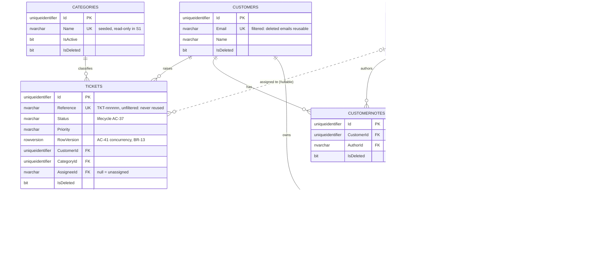
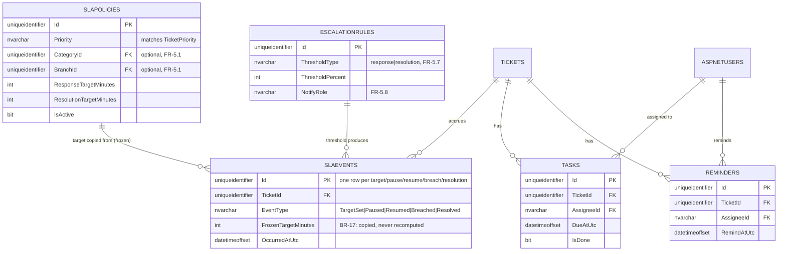
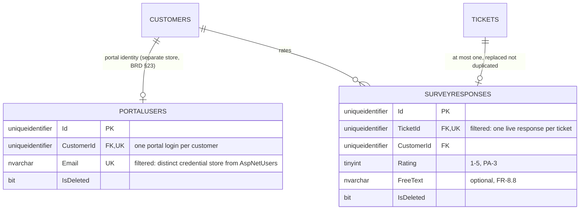
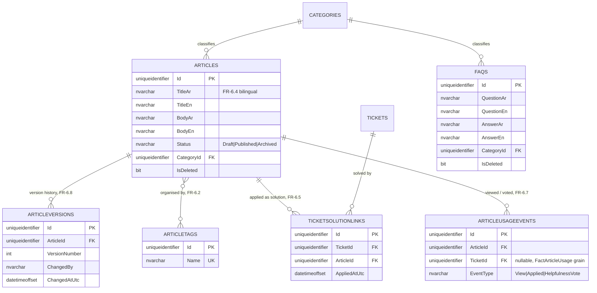
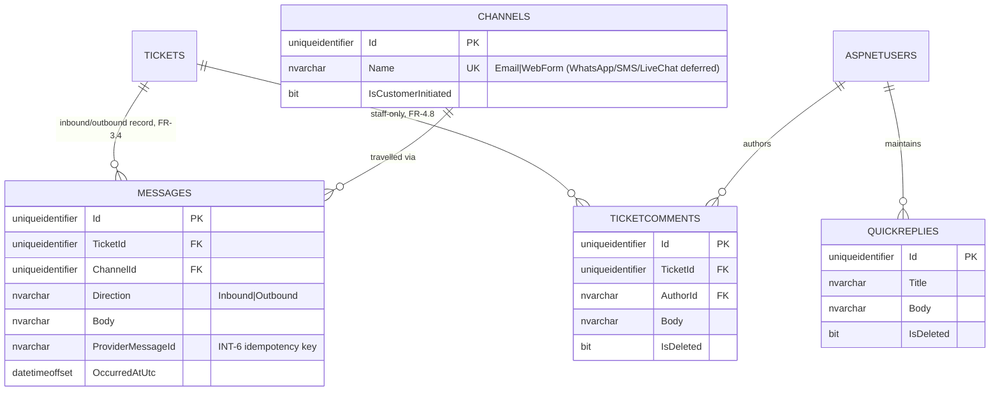
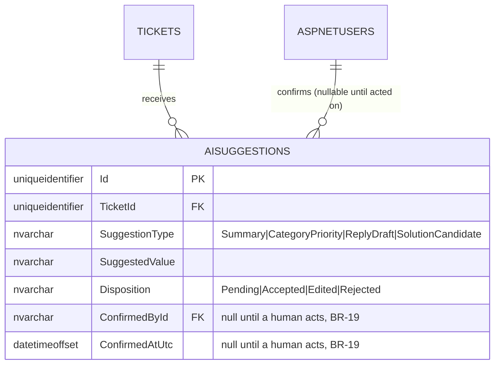
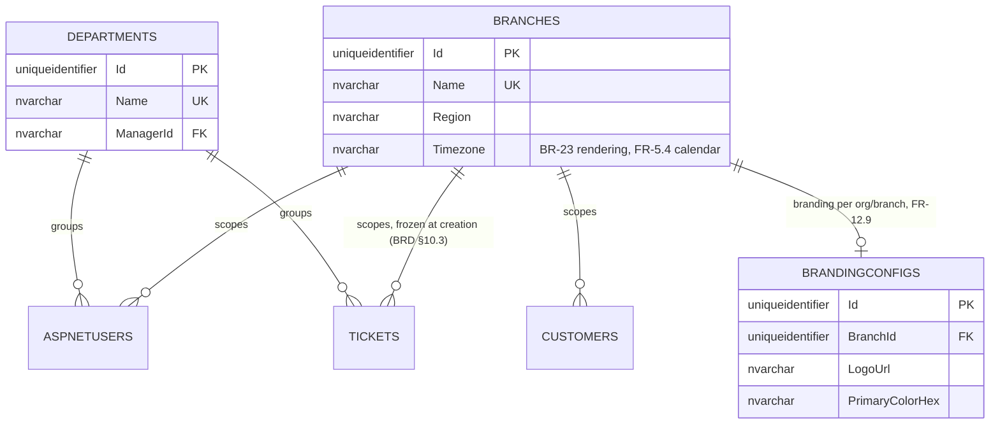
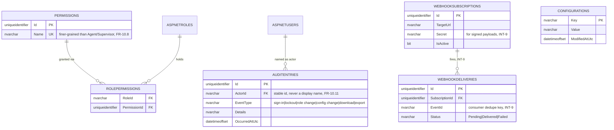

# ERD — entity relationships, whole product

A view of the data model implied by the twelve brief areas, not just the slice being built. It
exists so the shape of S2–S9 is visible without pretending any of it is built, and so a reader can
place any future table against something that already exists rather than guessing.

Rendered natively on GitHub; if your viewer shows plain text, any Mermaid renderer will draw it.

## 1. Purpose and authority

This file is a **rendered view**, not a source of truth. Three documents disagree in principle
about the same ground, and the precedence between them is fixed, not situational:

1. **The BRD** (`docs/brd/customer-support-crm-brd.md`) defines *what the product needs* — which
   entities must exist, and the business rules (`BR-1`..`BR-23`) they must satisfy. It wins on any
   question of scope: whether an entity exists at all, and why.
2. **For S1**, the [DDL](../superpowers/specs/EPIC-12-US-000-s1-schema.md) and, once written, the EF
   Core migration define *column shapes* — types, lengths, nullability, indexes. The migration
   becomes executable truth ahead of the DDL once it exists (the DDL says so itself); the DDL wins
   over this diagram in the meantime.
3. **This diagram** renders both, plus everything the BRD requires that has no schema yet (S2–S9).
   Where it disagrees with either of the above, **this file is wrong and gets fixed** — it does
   not get to overrule an upstream document by being more recently edited.

Entities beyond S1 are **not built**. They are drawn because the BRD requires the product to have
them eventually, and drawing them now is cheaper than re-deriving them per slice, and safer than
letting each slice spec invent its own shape for a table a neighbouring slice also needs (a
`TicketAttachments` join reusing `Assets` is exactly this kind of coordination). Nothing below
this line is an implementation claim.

## 2. Conventions

Stated once here instead of repeated on every entity.

- **Ids.** Every entity id is a `Guid` created by `Guid.CreateVersion7()` — never
  `Guid.NewGuid()` (F5). Version 7 is non-enumerable (an id does not leak a creation-order guess
  the way an integer identity would) and time-ordered (unlike v4), so clustered-index inserts
  append rather than fragment the page tree. The S1 DDL's `DEFAULT NEWSEQUENTIALID()` is a
  database-level fallback for a row inserted outside the application; in the normal path the
  application supplies the v7 value before `SaveChanges`.
- **Audit columns.** Every auditable table carries `CreatedAtUtc`, `CreatedBy`, `ModifiedAtUtc`,
  `ModifiedBy` (`IAuditable`, FND-23), populated only by the `SaveChanges` interceptor — never by a
  handler, never from a request payload. This is the schema-level enforcement of `BR-6`.
- **Soft delete.** Every soft-deletable table carries `IsDeleted`, `DeletedAtUtc`, `DeletedBy`
  (`ISoftDeletable`, FND-24). A delete is rewritten by the interceptor into an update; nothing is
  physically removed (`BR-8`, ADR 0006). `TicketHistory` is the deliberate exception — see §3.
- **Filtered unique indexes.** Every unique index on a soft-deletable table is
  `WHERE IsDeleted = 0` (FND-26). Without the filter, a deleted row still occupies the index slot:
  recreating a customer with a previously-used email would fail with a conflict pointing at a
  record the caller can no longer see — a bug nobody could resolve from the UI. The filter is what
  makes `BR-8` (retain, don't remove) and `BR-9` (email unique among the living) hold
  *simultaneously* rather than contradict each other. **One deliberate exception:**
  `UX_Tickets_Reference` is *not* filtered — a ticket reference, once issued, is never reused even
  after the ticket is deleted, because it may already have been read back to a customer over the
  phone; unlike an email address, it is evidence, not a reusable identity slot.
- **Mermaid cannot express a filtered index.** `erDiagram` has no syntax for a partial/filtered
  unique constraint, so every entity below states its filtered uniques in the row comment or the
  surrounding prose, never as a bare `UK` marker that would imply an ordinary, unfiltered one.
- **Timestamps.** All timestamps are `DATETIMEOFFSET`, stored and transmitted in UTC, rendered in
  the reader's timezone at the edge (`BR-23`).
- **No physical deletes, no cascades.** Referential integrity is reinforced by handlers refusing
  first (delete guards such as `BR-7`), not by `ON DELETE CASCADE`. The database never has to
  choose between orphaning a row and destroying history.
- **String-persisted enums.** `Status`, `Priority`, `ChangeType`, and every other enum-shaped
  column are `NVARCHAR`, never `INT` — reordering a C# enum must not renumber existing rows.

## 3. S1 core — built

The eight tables actually specified and (per the build order) partly built. Column shapes are
taken from the [DDL](../superpowers/specs/EPIC-12-US-000-s1-schema.md), which is authoritative over
this diagram for anything beyond keys and distinguishing fields.

Every soft-deletable table above carries the audit and soft-delete column set; `TicketHistory`
deliberately does not — it is append-only (`BR-5`), so no delete could mean anything.

### Relationships

| Edge | Cardinality meaning | Governing rules |
|---|---|---|
| Customers → Tickets | A customer has many tickets; a ticket belongs to exactly one customer | Delete guard: a customer holding at least one ticket may not be removed (`US-117`, `BR-7`) |
| Categories → Tickets | Fixed seeded list; every ticket classifies under exactly one category | Seeded read-only in S1 (assumption `A4`); free-text categories refused (`BR-14`) |
| AspNetUsers ⇢ Tickets | A ticket may have zero or one assignee; an agent holds many assigned tickets | Null `AssigneeId` is the unassigned queue state (`AC-29`); assignment restricted to **Supervisor** (`AC-42..44`, `BR-10`) — **corrected 2026-08-25**: two prior mentions of "Team Lead/Manager" named roles that exist nowhere else in this documentation set; every other source (S1 spec assumption `A2`, ADR 0003, BRD §14.1, and this file's own §6 role list) agrees on exactly two seeded roles, `Agent` and `Supervisor` |
| Tickets → TicketHistory | Every ticket accumulates an immutable event log | Append-only: no update or delete path exists (`AC-48..49`, `BR-5`); rows record all five change types — `Created`, `Assigned`, `Reassigned`, `StatusChanged`, `Reopened` — **corrected 2026-08-25**: this row previously omitted `Reassigned`, though the DDL and the entity attribute above both list five |
| Customers → CustomerNotes | Internal notes hang off exactly one customer | Author comes from the authenticated session, never the payload (`AC-19`, `BR-6`) |
| AspNetUsers → CustomerNotes | Each note has exactly one author | Same attribution rule as above |
| Customers → CustomerAttachments | A customer exposes many files through link rows | Upload allowlist + size cap before the stream is consumed (`NFR-8`) |
| Assets ⇢ CustomerAttachments | An asset sits in at most **one live link**; unlinking soft-deletes the link and retires the orphaned asset, freeing its storage name | Unique filtered index on `AssetId`; retrieval re-checks authorization per request (`NFR-7`, `US-132`) |
| AspNetUsers → Assets | Every stored file records exactly one uploader | Uploader from session (`UploadedById`), like all actor fields |

### Constraints that shape this diagram

- **Filtered uniques** — `UX_Customers_Email`, `UX_Categories_Name`, `UX_Assets_StoredFileName`,
  `UX_CustomerAttachments_Asset` are all `WHERE IsDeleted = 0` (FND-26): deleting frees the value
  instead of burning it. `UX_Tickets_Reference` is the stated exception (§2).
- **`Assets` is the single point of entry** — no other table stores file metadata. Future
  contexts extend by adding a link table (e.g. `TicketAttachments(TicketId, AssetId)`), never by
  altering the catalogue (2026-08-25 schema revision).
- **No cascades** — referential integrity is reinforced by handlers refusing first, never by the
  database orphaning or destroying rows.
- **Optimistic concurrency lives only on `Tickets`** — `RowVersion` backs the reopen and
  conflicting-edit refusal (`AC-41`, `BR-13`); other S1 tables have no concurrent-writer scenario
  specified yet.
- **Identity boundary** — `AspNetUsers` is owned by ASP.NET Core Identity; this schema adds only
  `DisplayName` and consumes its lockout columns. Roles `Agent` and `Supervisor` seed at startup
  (`A2`, ADR 0003) — no other role exists in S1.

## 4. Per-slice extension diagrams

Nothing in this section is built. Each diagram shows the slice's new entities plus only the S1
core entities they attach to — not the full core diagram again — because an entity list this wide
in one `erDiagram` block stops being readable.

### S2 — SLA & automation

**Why these tables.** A response/resolution commitment has to be derived once from the priority in
force at the time (`FR-5.1`, `FR-5.2`) and then survive every later edit to that priority or its
policy — that is `BR-17`, and it is the rule most often gotten wrong in a support system, because
"just recompute it from current config" is the obvious-looking shortcut that quietly rewrites
closed reporting periods. Symmetrically, `BR-18` requires that reopening a ticket start a *new*
resolution measurement without erasing the old one, so a resolution period cannot be a single
overwritable column on `Ticket` — each period has to be its own row.

`SlaEvents` deliberately carries every kind of SLA-relevant occurrence — target set, pause,
resume, breach, and each resolution — rather than splitting into separate tables, because `BR-17`
and `BR-18` both reduce to the same shape: *a value frozen at a point in time, retained regardless
of what happens to the configuration afterwards.* A resolution period is the span between one
`TargetSet`/`Resumed` row and the matching `Resolved` row; a reopen simply starts a fresh
`TargetSet` row rather than editing the old `Resolved` row. `FactSlaBreach` (§5) is a projection of
this table's `Breached` rows, not a separate physical fact.

`FR-2.14`'s escalation *state* lives on `Ticket` (a column this diagram does not need to add
anything for, beyond what §6 already lists); `EscalationRules` is area 5's *rules* that change it
— the brief's own area 2/area 5 split (§4).

`AssignmentRule` (`FR-5.6`, automatic assignment) is **not drawn**: nothing in the BRD or the S1
spec describes it as a row that a ticket references — it is evaluated at creation time against the
same signals `EscalationRules` already models (priority, category, branch), and modelling it
without a slice spec to constrain its shape would be inventing a requirement. Flagged as a gap for
S2's own spec, not decided here.

### S3 — Customer portal

**Why these tables.** BRD §23 records portal identity as a deliberately separate store from staff
identity — a customer logging into the portal must not be a row in `AspNetUsers` alongside agents
and supervisors, because the permission models, session lifetimes, and self-registration rules
differ completely (`B3` forbids staff self-registration; the portal *requires* customer
self-registration). `SurveyResponse` exists because `FR-8.7`/`PA-3` promise one rating per resolved
ticket, and data-quality rule 5 in BRD §12.7 requires a second response to **replace** the first,
not accumulate beside it — so the table needs a uniqueness constraint per ticket, not just a
foreign key.

`UX_SurveyResponses_Ticket` would be filtered `WHERE IsDeleted = 0`, same convention as everything
else soft-deletable: a replacement response soft-deletes the prior row and inserts a new one,
which is how "replaced not duplicated" becomes an enforced constraint rather than a handler
promise.

### S4 — Knowledge base

**Why these tables.** `FR-6.1` requires a draft→published→archived lifecycle, and `FR-6.8`
requires showing who changed what, when — a single mutable `Article` row cannot do both, so
`Articles` holds current state and `ArticleVersions` holds the history, the same
event-vs-restatement split as `FactTicketLifecycle`/`FactTicketEvent` in §5. `FAQ` is explicitly
`FR-6.3` — "a curated FAQ list **distinct** from the full article set" — so it is its own table,
not a flag on `Articles`. `TicketSolutionLinks` is `FR-6.5`, the applied-solution link that makes
knowledge-base deflection (`KPI-13`) and article usefulness measurable.

`FR-6.6` — only published articles are exposed to a customer — is an authorization/query-scope
rule against `Articles.Status`, not a schema addition: there is no separate "published articles"
table.

### S5 — Email channel

**Why these tables.** `FR-3.4` requires every inbound and outbound communication recorded against
its ticket with direction, channel and timestamp — this is the single highest-leverage row in the
whole BRD (§8.3), because `KPI-1` (first response time) and every SLA-response measure in S2 are
uncomputable without it. `Channel` is a lookup because `KPI-14` (channel mix) and `RPT-7` need to
group by it. `TicketComments` is a **new, third** kind of ticket-scoped text, deliberately distinct
from the two that already exist:

- `TicketHistory` (S1) is a structured, five-value state-change log — it has no room for free text
  and no `ChangeType` member for "someone said something to a colleague."
- `CustomerNotes` (S1) is scoped to the **customer**, not the ticket — it belongs in the customer
  profile, shown across every ticket that customer ever raises, and it predates any given ticket.
- `TicketComments` is scoped to **one ticket**, is unstructured free text, is never shown to the
  customer, and records no state change — it is a "for the next agent" note, not an audit entry
  and not a customer-file annotation. Reusing either existing table would either force fake
  history rows through a `ChangeType` enum that has no slot for a comment, or attach a
  ticket-specific remark to the customer's permanent record where it has no business being.

`Messages.ProviderMessageId` exists for `INT-6`: inbound email ingestion is idempotent on the
provider's message id, so a redelivery cannot create a second ticket or a duplicate message row.

### S7 — AI assist

**Why this table.** `BR-19` is the entire reason `AiSuggestion` has a `Disposition` and a
confirmation pair rather than just writing its suggestion straight into `Ticket`: no AI action may
change ticket state, and nothing AI-generated may reach a customer, without a recorded human
confirmation. That confirmation has to be a row a report can point to, not an assumption.

No code path applies `SuggestedValue` to `Tickets` directly; a handler reads a *confirmed*
suggestion and performs the ordinary, already-governed operation (e.g. the same status-change or
assignment path S1 already authorizes) — the AI subsystem never gets a shortcut around `BR-10` or
`BR-11`.

### S8 — Platform

**Why these tables.** `FR-12.7`/`FR-12.8` require grouping agents, tickets and categories by
department and branch, with branch-scoped visibility (`BR-21`). BRD §10.3 requires a ticket's
branch to be **frozen at creation**, from the customer and the creating agent, and never
recalculated — moving a ticket between branches retrospectively would rewrite closed reporting
periods, the identical failure mode `BR-17` prevents for SLA targets. `BrandingConfig` is
`FR-12.9`, deliberately thin (logo, colours) because §15 reads multi-department/branch as
organisational grouping with visibility scoping, not per-tenant isolation (`B4`) — there is no
per-branch schema to brand.

`Tickets.BranchId` and `Customers.BranchId` are additive columns on the S1 core tables, not new
tables — they are drawn as edges here rather than repeated in §3's diagram, since §3 is what is
actually built and neither column exists yet.

### S9 — Administration *(unscheduled — gap `G-2`)*

**Why these tables, and why this slice is flagged, not just listed.** The BRD proposes S9 itself
(`PA-5`) because area 10's remainder — user management, finer-grained permissions, the system-wide
audit log, and configuration — has no home in the brief's agreed slice table (`G-2`). Everything
below is drawn to show the shape the BRD implies, not to claim a build date.

`AuditEntries` is deliberately **wider** than `TicketHistory`: it covers sign-in success/failure,
lockout, role change, permission change, configuration change, attachment download, and report
export (§14.2) — none of which is a ticket state change, so none of it belongs in
`TicketHistory`'s five-value `ChangeType`. `Permissions`/`RolePermissions` exist because
`FR-10.8` asks for permissions finer-grained than the two seeded roles, which the S1 role check
(a hard-coded `Agent`/`Supervisor` policy) cannot express.

`Configurations` has no drawn relationship: it is a flat key/value store (`FR-10.10`), not a
row-per-entity table, so there is nothing to connect it to. `AspNetRoles` is Identity-owned, the
same boundary as `AspNetUsers` in §3 — it is drawn here only because S9 is the first slice whose
requirements (`FR-10.8`) touch it beyond the two seeded rows.

## 5. Reporting (S6) — views over the operational store, not physical tables

BRD §12.8 states this as a position, not a decision: report from the operational database through
purpose-built indexed projections **until** a stated threshold — 500,000 tickets, a report query
exceeding 2 seconds at p95, or `NFR-22` failing under concurrent load — and only then introduce a
separate analytical store. Drawing §12.5's facts and dimensions as if they were physical tables
here would misrepresent that decision, so they are listed, not diagrammed.

**Facts** (each a view/projection, grain as stated in BRD §12.5): `FactTicketLifecycle` (one row
per ticket — a restatement of final state), `FactTicketEvent` (one row per recorded change — the
event stream; `FactTicketLifecycle` and this fact both exist because "median resolution time" is
cheap against the first and "how long do tickets sit in Pending" is cheap against the second),
`FactSlaBreach` (one row per breached target — a projection of `SlaEvents.EventType = 'Breached'`
rows from §4, not a separate physical fact), `FactSurveyResponse`, `FactAgentActivity`,
`FactArticleUsage`.

**Dimensions**, with their type marked because the mark is the load-bearing fact about each one:

| Dimension | Type | Why |
|---|---|---|
| `DimDate`, `DimTimeOfDay`, `DimChannel`, `DimStatus` | Type 1 (overwrite in place) | Nothing about them changes meaning retroactively |
| `DimCustomer` | **Type 2** | Branch and language preference change; a customer's past tickets must not be rewritten to their current branch |
| `DimAgent` | **Type 2** | An agent moving team must not rewrite last quarter's throughput to the new team |
| `DimCategory`, `DimBranch`, `DimDepartment`, `DimArticle` | **Type 2** | Same reasoning: reorganisation must not rewrite closed periods |
| `DimPriority` | **Type 2** | Targets change over time, and `BR-17` requires the *old* target to survive against the tickets it was actually promised to |

Because this layer is views until the threshold is crossed, **Type 2 history has to be captured by
the operational model itself, from the slice that introduces each dimension** — `SlaEvents` in §4
already does this for priority targets; `Branches`/`Departments` in §4 would need their own
change-tracking if reorganisation history matters before S6 ships. It cannot be retrofitted: history
that was overwritten before capture began is gone (`RSK-7`, `PA-8`).

## 6. Enumerations

**`TicketStatus`**: `New`, `Open`, `Pending`, `Resolved`, `Closed`.

Closed transition table (BRD §7.2, S1 spec):

| From \ To | New | Open | Pending | Resolved | Closed |
|---|---|---|---|---|---|
| **New** | — | ✓ | — | — | — |
| **Open** | — | — | ✓ | ✓ | — |
| **Pending** | — | ✓ | — | ✓ | — |
| **Resolved** | — | ✓ (reopen) | — | — | ✓ |
| **Closed** | — | ✓ (reopen) | — | — | — |

Everything not marked ✓ is refused, including every cell on the diagonal (`BR-4`, no
self-transition). `New → Closed` is impossible by construction — closing a request nobody opened
means the request was never real or the record is wrong, and both deserve a refusal rather than a
silent jump.

**`TicketPriority`**: `Low`, `Normal`, `High`, `Urgent`. **The BRD never defines these values** —
area 2 and area 5 both discuss priority without enumerating it. This closes that gap; it is this
diagram's own decision, not a restatement of a BRD list, and a future SLA policy conversation
(`OQ-2`) could still revise it.

**`TicketChangeType`**: `Created`, `Assigned`, `Reassigned`, `StatusChanged`, `Reopened` — all
five, matching the DDL. (§3 fixes this diagram's own previous four-value list, which omitted
`Reassigned`.)

**Roles**: `Agent`, `Supervisor` seeded at startup in S1 (`A2`, ADR 0003). `Customer` arrives with
the portal identity store in S3 (§4) — note it is a distinct store, not a third `AspNetRoles` row.
`Administrator` arrives with S9 (§4), if and when `G-2` is resolved.

**Channels**: `Email`, `WebForm` in scope (S5, S3); `WhatsApp`, `SMS`, `LiveChat` deferred
indefinitely (BRD §6.3) — present as a concept in `Channels.Name` only to the extent that a future
row could exist, not as seeded data.

**Article lifecycle** (`FR-6.1`): `Draft` → `Published` → `Archived`. No reverse transition is
specified by the BRD; treated as a gap for S4's own spec.

**AI suggestion disposition** (`FR-7.5`, `BR-19`): `Pending`, `Accepted`, `Edited`, `Rejected`.

## 7. Cases that shape the schema — `BR-1`..`BR-23`

| Rule | What it forces |
|---|---|
| **BR-1** — a ticket belongs to exactly one customer | `Tickets.CustomerId` is a single `NOT NULL` FK, not a join table |
| **BR-2** — a ticket has at most one assignee | `Tickets.AssigneeId` is a single nullable FK column, not a many-to-many link |
| **BR-3** — status moves only along the permitted table | No DB `CHECK` constraint can express it (a transition rule needs the *current* value, which only application code has loaded); enforced in the `Ticket` entity's state machine, tested at `Domain.Tests` level |
| **BR-4** — no self-transition | Same enforcement point as `BR-3`; the transition table's diagonal is empty |
| **BR-5** — history is append-only | `TicketHistory` has **no** `IsDeleted`/`ModifiedAtUtc` columns at all — the absence is the enforcement, because there is no code path that could populate them |
| **BR-6** — actor from session, never payload | `TicketHistory.ActorId`, `CustomerNotes.AuthorId`, `Assets.UploadedById` are `NOT NULL`, populated only by the audit interceptor from `ICurrentUser`, never bound from a request DTO |
| **BR-7** — delete guard: a customer with ≥1 ticket may not be deleted | Application-layer guard (not a DB constraint) that checks for existing `Tickets` rows before soft-deleting a `Customer`; `IX_Tickets_CustomerId` exists so that check is cheap |
| **BR-8** — retain, don't remove | `IsDeleted`/`DeletedAtUtc`/`DeletedBy` on every soft-deletable table; no `DELETE` statement is ever issued by application code |
| **BR-9** — email unique among the living | `UX_Customers_Email` filtered `WHERE IsDeleted = 0` |
| **BR-10** — only a Supervisor assigns or reassigns | Not a schema constraint — an endpoint authorization policy; the schema consequence is only that `AssigneeId` must be nullable and mutable |
| **BR-11** — status change belongs to the ticket's assignee (agent) or any (supervisor) | Handler-level ownership check reading the already-loaded `Tickets.AssigneeId`; no endpoint-level role policy can express it, because only the loaded row knows who it is assigned to |
| **BR-12** — lockout indistinguishable from a wrong password | No separate "locked" flag is exposed via the API; `AspNetUsers.AccessFailedCount`/`LockoutEnd` (Identity-provided) drive one shared 401 path |
| **BR-13** — conflicting concurrent change refused, not overwritten | `Tickets.RowVersion` (`ROWVERSION`), mapped as an EF concurrency token |
| **BR-14** — controlled category list, no free text | `Categories` table + `Tickets.CategoryId NOT NULL FK`; no free-text category column exists anywhere on `Tickets` |
| **BR-15** — unique, stable, human-readable reference | `UX_Tickets_Reference`, deliberately **unfiltered** (§2) |
| **BR-16** — SLA clock pauses on `Pending`, resumes on exit | `SlaEvents.EventType IN ('Paused','Resumed')` rows (§4, S2) |
| **BR-17** — SLA target frozen from priority at time of setting, never recomputed | `SlaEvents.FrozenTargetMinutes` copied from `SlaPolicies` at insert time; later `SlaPolicies` edits never touch existing `SlaEvents` rows (§4) |
| **BR-18** — reopen starts a new resolution period; the old one is retained | Resolution periods are `SlaEvents` **rows**, not a column on `Ticket` that a reopen would have to overwrite (§4) |
| **BR-19** — no AI action changes state or reaches a customer without human confirmation | `AiSuggestions.ConfirmedById`/`ConfirmedAtUtc` nullable until a human acts; no handler applies `SuggestedValue` directly to `Tickets` (§4) |
| **BR-20** — a customer sees only their own tickets and only published articles | Query-scope rule comparing `Tickets.CustomerId` to the caller's linked `PortalUsers.CustomerId`, and `Articles.Status = 'Published'` filter for portal callers — authorization logic, not an extra column beyond `Articles.Status` |
| **BR-21** — branch-scoped visibility | `Tickets.BranchId`/`Customers.BranchId` (§4, S8), queried with a branch filter the same shape as the global soft-delete filter |
| **BR-22** — every response carries both languages | Not a schema concern — the message catalogue lives outside the database (ADR 0007) |
| **BR-23** — timestamps UTC, rendered in reader's timezone | Every `*AtUtc` column is `DATETIMEOFFSET`; convention stated once in §2 rather than per table |

## 8. Deliberately deferred

So an absence here reads as a decision, not an oversight:

- **A physical analytical store.** §5's facts and dimensions are views/projections until the
  500,000-ticket / 2-second-p95 threshold in BRD §12.8. No `FactTicketLifecycle` table exists.
- **Tenant-per-branch schema.** Branch scoping is a query filter (`BR-21`), not a separate schema
  or database per branch (`B4`, `NFR-21`) — there is no `BranchId`-partitioned physical design.
- **Duplicate-customer merge tooling.** `PA-2` assumes one customer = one email; merging two
  records that turn out to be the same person is not modelled, and `OQ-1` asks whether it should
  be — no slice currently claims it.
- **A distinct data-subject erasure capability.** Soft delete (`BR-8`) is not erasure. `OQ-7`
  raises this as open; no "purge" table or process is drawn.
- **ERP-owned customer identity.** BRD §10.3 says an ERP integration would make the ERP master for
  customer identity, with this system holding a reference (`INT-8`). No such reference column
  exists — `FR-11.8` is `W` (deferred indefinitely) and `DEP-7` (a named ERP) is unmet.
- **WhatsApp, SMS, live chat as real channels.** `Channels` (§4) can hold a row for any of these
  shape-wise, but none is seeded, staffed, or integrated — deferred indefinitely per BRD §6.3.
- **`AssignmentRule` (automatic assignment, `FR-5.6`).** Named in the BRD but not modelled here —
  see the note in §4's S2 section. A gap for S2's own spec to close, not decided by this diagram.
- **Article lifecycle reverse transitions and approval workflow.** `FR-6.1` names the three states;
  nothing in the BRD specifies whether `Archived → Draft` is legal. Left open for S4.
- **S9 in its entirety** is unscheduled (`G-2`). Its tables are drawn in §4 to show the shape the
  BRD implies, not because a slice claims them.

See also: [domain-model.md](domain-model.md) for why the S1 tables group into aggregates, and the
[S1 schema spec](../superpowers/specs/EPIC-12-US-000-s1-schema.md) for complete DDL and indexes.
