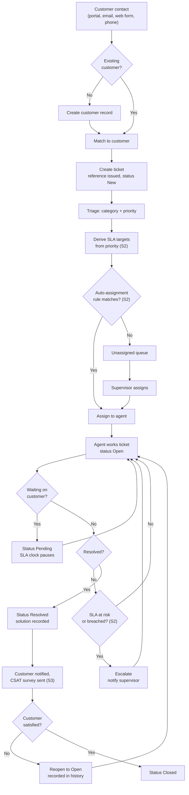
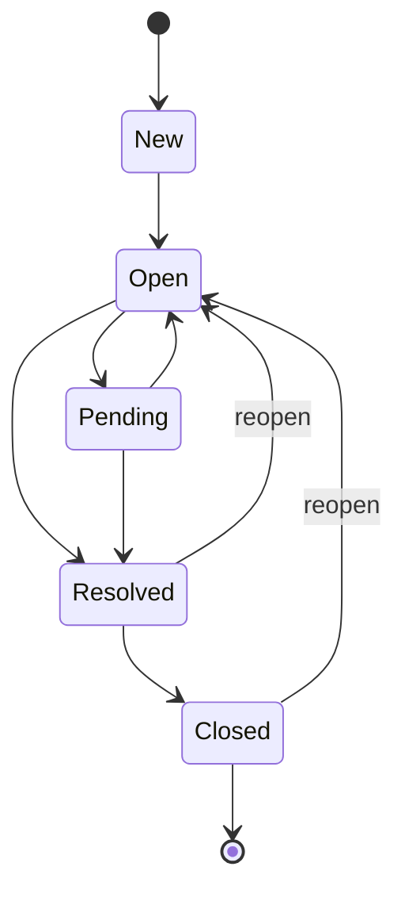
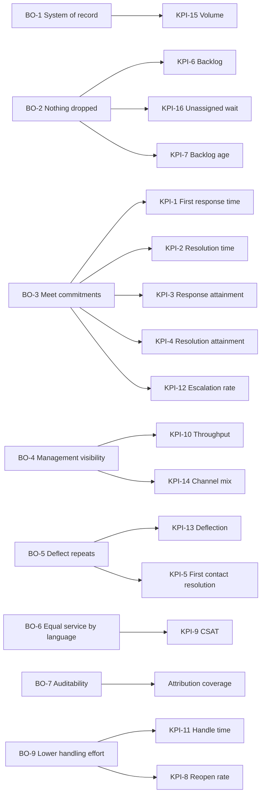

# Business Requirements Document — Customer Support CRM

## 1. Document control

| Field | Value |
|---|---|
| Document | Business Requirements Document — Customer Support CRM |
| Version | 1.0 |
| Date | 2026-08-24 |
| Author | Mohamed Rashed — business analysis |
| Status | Draft for review |
| Upstream source | `docs/assessment/brief.md` (client brief, captured verbatim) |
| Downstream artifacts | `docs/requirements/`, `docs/superpowers/specs/`, `docs/adr/` |

**Precedence.** This document is downstream of `docs/assessment/brief.md` and **may not contradict
it**. Where this document appears to, the brief wins and the conflict is raised in section 22
rather than resolved quietly. It is also downstream of the two committed specs and the seven ADRs:
where a requirement here restates a decision already recorded, it cites it rather than restating it
in different words.

**What this document is not.** It is not a technical specification. It states what the business
needs and how success is measured. The physical schema, HTTP contracts and test strategy belong to
`docs/superpowers/specs/` and are referenced, not duplicated — two documents describing the same
schema in different words is a guarantee that one of them is wrong.

### Change log

| Version | Date | Change |
|---|---|---|
| 1.0 | 2026-08-24 | Initial document. Derived from the verbatim brief's twelve feature areas and the agreed eight-slice decomposition. |

### Identifier conventions

Prefixes are namespaced per document so no two artifacts can collide, following the convention
already set by the specs (`AC-n` for slice S1, `FND-n` for the backend foundation).

| Prefix | Meaning |
|---|---|
| `BO-n` | Business objective |
| `FR-<area>.<n>` | Functional requirement; `<area>` is the brief's own area number, 1–12 |
| `BR-n` | Business rule — an invariant that outlives any interface |
| `NFR-n` | Non-functional requirement |
| `KPI-n` | Key performance indicator |
| `RPT-n` / `DSH-n` | Report / dashboard |
| `INT-n` | Integration requirement |
| `PA-n` | Product assumption introduced by this document |
| `DEP-n` / `RSK-n` / `CON-n` | Dependency / risk / constraint |
| `OQ-n` / `G-n` | Open question / gap raised against the brief |

`FR-<area>.<n>` deliberately keys off the brief's numbering, so any requirement traces back to the
client's own words by reading its identifier. Identifiers are permanent: new ones are appended,
never inserted, and never renumbered.

Requirement priority uses MoSCoW — **M**ust, **S**hould, **C**ould, **W**on't (this product
generation). Priority within S1 additionally uses the spec's own P0/P1/P2 marks, so the two
documents cut in the same order.

---

## 2. Executive summary

A support organisation currently receives customer requests through personal inboxes and tracks
them in spreadsheets. Nobody can answer, at any moment, which requests are outstanding, who owns
each one, what state it is in, or who changed it last. Work is duplicated, requests are dropped
silently, and there is no record of who did what.

This document specifies a Customer Support CRM that makes the request the unit of record: every
customer contact becomes a ticket with an owner, a state, a commitment and an audit trail;
management gets measurement instead of anecdote; and customers get a way to submit and track their
own requests in Arabic or English.

The brief describes twelve feature areas that together constitute a complete commercial support
platform — five communication channels, an AI subsystem, a customer portal, reporting, ERP
integration, bilingual RTL support and multi-branch tenancy. That is a multi-team, multi-quarter
product. It is therefore read as the **product vision**, delivered as **eight slices**, of which
**slice S1 (ticket lifecycle) is the assessment deliverable** and the remaining seven are
documented so the path is visible without being built. This reading is not introduced here — it is
already agreed and recorded in `brief.md` as assumption **B1**.

Three things are worth reading before the requirement tables:

- **Section 12, the measurement framework**, states which KPIs are computable from the delivered
  slice and which are not. First response time — the single most quoted support metric — is **not
  measurable at all** in S1, because S1 contains no outbound-message concept. That is a sequencing
  fact, not an oversight, and it is better argued now than discovered in a steering meeting.
- **Section 9, the business rules**, are the invariants the system exists to enforce. They are the
  part of this document that survives a change of technology.
- **Section 22** raises two genuine gaps in the agreed slice decomposition, where the brief's own
  out-of-scope list promises a home for a feature that its slice table does not actually give it.

---

## 3. Business context

### 3.1 The current state

Requests arrive by whatever route the customer already knows: a reply to an old email thread, a
call to someone they dealt with before, a message to a shared inbox. Each agent keeps their own
working list. A spreadsheet is maintained for reporting, updated when someone remembers.

The consequences are structural rather than accidental:

| Symptom | Business cost | Objective it blocks |
|---|---|---|
| No single list of outstanding requests | Requests are dropped silently; the first anyone hears is a complaint | `BO-2` |
| No owner per request | Two agents work the same issue, or none does | `BO-1` |
| No state per request | "Where is my request?" cannot be answered without asking around | `BO-1` |
| No commitment per request | Response and resolution times are whatever they turn out to be | `BO-3` |
| No audit of changes | Disputes about what was promised cannot be settled | `BO-7` |
| No history per customer | Every contact starts from nothing; the customer repeats themselves | `BO-1` |
| Reporting is a manual spreadsheet | Decisions rest on anecdote, and the numbers are unfalsifiable | `BO-4` |
| Repeat questions answered individually | Agent time spent on answers that already exist in writing | `BO-5` |
| Arabic-speaking customers served ad hoc | Service quality depends on which agent picks up | `BO-6` |

The last row is the one usually left out of a document like this. It is the reason area 12 is a
requirement and not a nicety.

### 3.2 The target state

One system holds every customer, every request, and every change made to a request. A request has
an owner, a state drawn from a defined lifecycle, a commitment derived from its priority, and an
append-only history. Customers submit and track requests themselves. Repeat questions are answered
once, published, and found by search. Management reads the same numbers the agents generate,
computed from the operational record rather than re-entered.

### 3.3 What the assessment delivers

Slice S1 end to end: authentication with two roles, customer records with notes and attachments,
tickets with category, priority, status, assignment and history, and an agent web application over
them. Sections 6.2 and 19 state exactly which requirements that covers and which it does not.

---

## 4. Business objectives

Every objective names the KPI that measures it. An objective with no measure attached is a slogan,
and it will be reported as achieved by whoever is asked.

| Id | Objective | Measured by | Target | Horizon |
|---|---|---|---|---|
| **BO-1** | Establish one system of record for customers and their requests | `KPI-15` share of known contacts recorded as tickets | ≥ 95% | S1 |
| **BO-2** | Ensure no request is dropped or left unowned | `KPI-6` open backlog, `KPI-16` unassigned queue wait | 0 tickets unassigned > 4 business hours | S1 + S2 |
| **BO-3** | Meet agreed response and resolution commitments | `KPI-3`, `KPI-4` SLA attainment | ≥ 90% response, ≥ 85% resolution | S2 |
| **BO-4** | Give management a factual view of workload and performance | `DSH-1` in use; `KPI-1`–`KPI-12` published | Weekly review runs off the dashboard, not a spreadsheet | S6 |
| **BO-5** | Reduce effort spent re-answering known questions | `KPI-13` knowledge-base deflection rate | ≥ 20% of portal sessions resolved without a ticket | S3 + S4 |
| **BO-6** | Serve Arabic and English speakers to the same standard | `KPI-9` CSAT split by language; zero untranslated user-facing strings | CSAT gap between languages ≤ 0.3 points | S8 |
| **BO-7** | Make every change to a request attributable and auditable | Share of state changes carrying actor and timestamp | 100%, enforced by the data model | S1 |
| **BO-8** | Support multiple departments and branches without separate deployments | Branch-scoped access working on one deployment | 1 deployment, n branches | S8 |
| **BO-9** | Reduce agent handling effort per request | `KPI-11` average handle time; `KPI-5` first contact resolution | AHT −15% against the S6 baseline | S7 |

`BO-9` is deliberately last and deliberately vague on its baseline: there is no measurement before
S6, so any earlier target would be invented. Stating the dependency is more useful than stating a
number nobody can check.

---

## 5. Stakeholders and personas

### 5.1 Stakeholder register

| Stakeholder | Role in the process | Primary need | Influence | Interest |
|---|---|---|---|---|
| Customer | Raises requests, receives answers | Submit easily, know the status, be understood in their language | Low | High |
| Support agent | Works assigned tickets | A clear queue, customer context in one place, no duplicated effort | Medium | High |
| Supervisor / team lead | Assigns work, handles escalation | Queue visibility, ability to reassign and escalate | High | High |
| Department manager | Owns a department's service level | SLA attainment and staffing evidence for their department | High | Medium |
| Knowledge-base author | Writes and maintains articles | Authoring, review and publication with versioning | Low | Medium |
| System administrator | Manages users, roles and configuration | Account lifecycle, permissions, audit log, settings without a deployment | Medium | Medium |
| Executive sponsor | Funds the programme | Cost per contact, satisfaction, trend over time | High | Low |
| Integration owner | Connects surrounding systems | A documented, stable, authenticated API | Medium | Medium |
| Data protection owner | Accountable for personal data | Lawful handling, retention, and an audit trail | High | Low |

The two rows most often missing from a support CRM requirements document are the last two. The
integration owner determines whether area 11 is real or decorative; the data protection owner
determines whether attachments and audit logs are permissible at the retention the business wants.

### 5.2 Personas

**The customer.** Contacts support two or three times a year, usually about something already
half-explained in an earlier thread. They want to know the request was received and roughly when it
will be answered. They will not learn a new tool to do it, and they will read the reply in
whichever of Arabic or English they wrote in. Their pain today is silence — not slow answers, but
not knowing whether anyone holds the request at all.

**The agent.** Works a queue for a full shift and is measured on it. They need the customer's
history beside the request, not two clicks away, because the alternative is asking the customer to
repeat themselves. Their pain today is duplicated work and the small dread of a request they were
never told was theirs.

**The supervisor.** Answers for the queue rather than working it. They need to see what is
outstanding, who has capacity, and what is about to breach — then reassign. Their pain today is
that every one of those answers requires asking a person.

**The department manager.** Reads numbers weekly and is challenged on them monthly. They need
figures they can defend, computed the same way every time, with a stated definition. Their pain
today is that the spreadsheet's numbers change depending on who filled it in.

---

## 6. Scope

### 6.1 In scope — the twelve areas

All twelve areas of the brief are in scope for the **product**. Section 8 states their
requirements; section 6.2 states when each is delivered.

| Area | Name | Requirements | First delivering slice |
|---|---|---|---|
| 1 | Customer Management | `FR-1.*` | S1 |
| 2 | Ticket Management | `FR-2.*` | S1 |
| 3 | Communication Channels | `FR-3.*` | S3 (web form), S5 (email) |
| 4 | Agent Dashboard | `FR-4.*` | S1 (partial) |
| 5 | SLA & Automation | `FR-5.*` | S2 |
| 6 | Knowledge Base | `FR-6.*` | S4 |
| 7 | AI Features | `FR-7.*` | S7 |
| 8 | Customer Portal | `FR-8.*` | S3 |
| 9 | Reports & Management | `FR-9.*` | S6 |
| 10 | Security & Administration | `FR-10.*` | S1 (partial) |
| 11 | Integrations | `FR-11.*` | S1 (own API), S5 (email) |
| 12 | Platform | `FR-12.*` | S1 (mechanism), S8 (full) |

### 6.2 Delivery phasing

This table restates the decomposition already agreed and recorded in `brief.md`. It is repeated
here — not re-derived — so this document is readable on its own. If the two ever disagree,
`brief.md` is correct.

| Slice | Sprint(s) | Content | Brief areas | Status |
|---|---|---|---|---|
| **S1 — Ticket lifecycle** | **1–5** | Auth and roles, customers with notes and attachments, tickets with category/priority/status/assignment, ticket history, agent views | 1, 2, 4 (part), 10 (part) | **The assessment deliverable.** Specified; partly built |
| S2 — SLA & automation | 8 | Response and resolution targets, auto-assignment, escalation rules, alerts | 5 | Not specified |
| S3 — Customer portal | 10 | Submit, track, history, feedback, web-form channel | 8, 3 (part) | Not specified |
| S4 — Knowledge base | 11 | FAQs, articles, solutions, search | 6 | Not specified |
| S5 — Email channel | **6** (message record) · 9 (provider) | Inbound and outbound email in depth | 3 (part), 11 (part) | Not specified |
| S6 — Reporting | 13 | Ticket, SLA, agent and satisfaction reports; dashboards | 9 | Not specified |
| S7 — AI assist | 15 | Summaries, auto-categorisation, suggested replies and solutions | 7 | Not specified |
| S8 — Platform | **7** (departments, branches) · 14 (translation, RTL, branding) | Arabic/English translation and RTL, branding, multi-department, multi-branch | 12 | Not specified |
| S9 — Administration *(proposed)* | 12 | User management interface, granular permissions, system-wide audit log, configuration | 10 (remainder) | **Proposed by this document — see `G-2`** |

S1 is first because every other slice needs a ticket to exist. Its specification is
`docs/superpowers/specs/EPIC-02-US-016-ticket-lifecycle.md`, with the cross-cutting response,
messaging and persistence foundation in
`docs/superpowers/specs/EPIC-01-US-101-backend-foundation-design.md`.

**Slice order and sprint order are not the same thing.** The nine slices above are the units of
*specification* and their content is unchanged from `brief.md`. Sprints are the units of *delivery*,
and they are sequenced by dependency rather than by slice number — which is why S5's message record
runs at sprint 6, four sprints ahead of the email provider it was originally bundled with, and why
S8 splits into an early organisational half and a late localisation half.

Three of the gaps in section 22 are what forced that: `G-3` (S2 cannot measure a response without
S5's message record) and `RSK-7` (branch and department history cannot be retrofitted, so those
dimensions must exist before anything reports on them). The full sequence, with the reasoning per
sprint, is in [`docs/requirements/delivery-plan.md`](../requirements/delivery-plan.md).

**S9 does not exist in `brief.md`.** It is proposed here because area 10's remainder has no home in
the agreed table. That is raised as gap `G-2`, not asserted as agreed.

### 6.3 Out of scope — deferred indefinitely

Taken from the brief's own decomposition, unchanged: **WhatsApp, SMS, live chat, ERP connectors,
the AI chatbot, and native mobile applications.** Each is a `W` in section 8, and each has a stated
reason rather than a shrug:

- WhatsApp, SMS and live chat each require a paid provider, a verified business identity, and
  staffing for a real-time channel. Opening a channel nobody is rostered to answer degrades
  service rather than extending it.
- ERP connectors require a named ERP and its integration contract. Neither exists in the brief.
- The AI chatbot is deferred rather than stubbed, per `B5`: a stub would misrepresent the
  capability, and a customer-facing bot that answers wrongly is worse than no bot.
- Native mobile is out of scope under the brief's own "web and mobile friendly" wording, read as a
  responsive web application. That is the brief's ambiguity ruling, not a new decision here.

### 6.4 Out of scope for the assessment deliverable

Everything not in S1. The full list is in `brief.md` and repeated in the S1 spec, so the boundary is
visible from either document. It is a set of scheduling decisions, not omissions: every item is
assigned a slice in section 6.2, and the two that are not are raised in section 22.

---

## 7. To-be business processes

### 7.1 End-to-end request lifecycle

Everything marked `(S2)` or `(S3)` is a later slice. In S1 the flow is the same minus the SLA
derivation, auto-assignment, escalation and survey: contact, customer match, ticket, manual
triage, manual assignment, work, resolve, close.

### 7.2 Ticket state lifecycle

The lifecycle is a closed transition table, not a free-text status field. It is reproduced from the
S1 spec, where it is the domain rule the slice is built around; the spec is authoritative.

Permitted: `New → Open` · `Open → Pending` · `Open → Resolved` · `Pending → Open` ·
`Pending → Resolved` · `Resolved → Closed` · `Resolved → Open` · `Closed → Open`.
**Every other transition is refused** — see `BR-3`, `BR-4`.

`New → Closed` is deliberately impossible. Closing a request nobody opened means either the request
was never real or the record is wrong, and both deserve a refusal rather than a silent state jump.

### 7.3 Process narratives

**P1 — Intake and triage.** A contact is matched to an existing customer by email, or a customer
record is created. A ticket is created with subject, description, category and priority, and issued
a human-readable reference. Category comes from a controlled list (`BR-14`) because free-text
categories destroy every categorised report within a month.

**P2 — Assignment.** A supervisor assigns the ticket, or an automatic rule does (S2). Only a
supervisor may assign or reassign (`BR-10`). Every assignment appends a history entry.

**P3 — Working.** The agent works the ticket, moving it between `Open` and `Pending` as it waits on
the customer. An agent may change the status only of a ticket assigned to them (`BR-11`) — this is
checked when the ticket is loaded, because role-level permission cannot see who a ticket belongs to.

**P4 — Resolution and closure.** The agent resolves; the customer confirms or the ticket closes on a
timer (S2). A resolved or closed ticket can be reopened, and the reopen is recorded (`BR-18`).

**P5 — Escalation (S2).** Crossing a response or resolution threshold raises the ticket's escalation
state and notifies the supervisor. Area 2 owns the escalation *state*; area 5 owns the *rules* that
change it — this split is the brief's own ambiguity ruling.

**P6 — Knowledge-assisted resolution (S4).** The agent searches the knowledge base, applies an
article as the solution, and the link is recorded so deflection and article usefulness become
measurable (`KPI-13`).

**P7 — Feedback (S3).** On resolution the customer receives a single-question satisfaction survey.
One question, because response rates fall off a cliff at two.

---

## 8. Functional requirements

One subsection per brief area. `Slice` states when the requirement is first satisfied; `S1 AC`
cites the acceptance criterion in the S1 spec that proves it, and is empty wherever S1 does not
cover the requirement. An empty `S1 AC` cell on an `M` row is not a defect — it is a requirement
scheduled to a later slice.

### 8.1 Area 1 — Customer Management

| Id | Requirement | MoSCoW | Slice | S1 AC |
|---|---|---|---|---|
| **FR-1.1** | Create a customer record with, at minimum, a name and an email address | M | S1 | AC-7 |
| **FR-1.2** | Reject invalid or incomplete customer data with errors keyed to the offending field | M | S1 | AC-8 |
| **FR-1.3** | Refuse a customer email already in use, naming the rule that was violated | M | S1 | AC-9 |
| **FR-1.4** | List customers with server-side pagination and a bounded page size | M | S1 | AC-10, AC-11 |
| **FR-1.5** | Search customers by name or email, case-insensitively | S | S1 | AC-13 |
| **FR-1.6** | Retrieve a single customer profile | M | S1 | AC-12 |
| **FR-1.7** | Update customer contact details under the same validation rules as creation | S | S1 | AC-14 |
| **FR-1.8** | Refuse deletion of a customer that has at least one ticket | M | S1 | AC-15 |
| **FR-1.9** | Delete a customer with no tickets, retaining the record and releasing its email for reuse | S | S1 | AC-16 |
| **FR-1.10** | Hold multiple contact points per customer — email, telephone, and a messaging number | M | S1 (email, phone) · S5 (messaging) | AC-7 |
| **FR-1.11** | Record free-text notes against a customer, attributed to the authenticated author | S | S1 | AC-17, AC-19 |
| **FR-1.12** | List a customer's notes newest first, paginated | S | S1 | AC-21 |
| **FR-1.13** | Attach files to a customer within a size limit and a content-type allowlist | S | S1 | AC-22, AC-23, AC-24 |
| **FR-1.14** | Store attachments so that a hostile filename cannot escape the storage directory | M | S1 | AC-25 |
| **FR-1.15** | Download an attachment only after authenticating and authorising the caller | C | S1 | AC-26 |
| **FR-1.16** | Remove an attachment, retaining its metadata record | C | S1 | AC-28 |
| **FR-1.17** | Show a customer's interaction history — the cross-ticket timeline of their contacts | S | S3 | |
| **FR-1.18** | Assign a customer to a branch, for branch-scoped visibility | S | S8 | |

`FR-1.17` is the brief's "interaction history" and is deliberately distinct from ticket history
(`FR-2.12`). The brief's ambiguity ruling separates them: ticket history is one ticket's audit
trail; interaction history is the customer's timeline across tickets.

### 8.2 Area 2 — Ticket Management

| Id | Requirement | MoSCoW | Slice | S1 AC |
|---|---|---|---|---|
| **FR-2.1** | Create a ticket against a customer with a subject, category and priority | M | S1 | AC-29 |
| **FR-2.2** | Issue every ticket a human-readable reference, stable for its lifetime | M | S1 | AC-29 |
| **FR-2.3** | Validate ticket input per field, and identify an unknown customer or category by field | M | S1 | AC-30, AC-31 |
| **FR-2.4** | List tickets with pagination, newest first | M | S1 | AC-32 |
| **FR-2.5** | Filter tickets by status, priority, assignee and customer, with filters combining | M | S1 | AC-33 |
| **FR-2.6** | Filter the list to the calling agent's own assigned tickets | M | S1 | AC-34 |
| **FR-2.7** | Retrieve ticket detail with a customer summary and the ticket's history | M | S1 | AC-35, AC-36 |
| **FR-2.8** | Move a ticket only along the defined status lifecycle, refusing any other transition | M | S1 | AC-37, AC-38 |
| **FR-2.9** | Refuse a transition to the status the ticket already holds | M | S1 | AC-39 |
| **FR-2.10** | Reopen a resolved or closed ticket, recording the reopen | S | S1 | AC-40 |
| **FR-2.11** | Refuse a conflicting concurrent change rather than overwriting silently | S | S1 | AC-41 |
| **FR-2.12** | Assign or reassign a ticket to a valid agent | M | S1 | AC-42, AC-44 |
| **FR-2.13** | Append an immutable history entry for every creation, assignment and status change, recording actor, timestamp and the from/to values | M | S1 | AC-48, AC-49, AC-50 |
| **FR-2.14** | Hold an escalation state on the ticket, changed by the rules in area 5 | S | S2 | |
| **FR-2.15** | Record the channel a ticket originated from | M | S3, S5 | |
| **FR-2.16** | Maintain the category taxonomy without a deployment | S | S9 *(proposed)* | |

`FR-2.16` is `S9` rather than `S1` because the S1 spec's assumption `A4` fixes categories to a
seeded list maintained by a developer. Making the taxonomy editable is an administration
capability, and administration has no slice in the agreed table — see `G-2`.

### 8.3 Area 3 — Communication Channels

| Id | Requirement | MoSCoW | Slice | S1 AC |
|---|---|---|---|---|
| **FR-3.1** | Accept a request submitted through a web form, creating a ticket | M | S3 | |
| **FR-3.2** | Ingest inbound email as a new ticket, or as a reply on the existing ticket it threads to | M | S5 | |
| **FR-3.3** | Send an outbound email reply from the ticket, recorded against the ticket | M | S5 | |
| **FR-3.4** | Record every inbound and outbound message against its ticket with direction, channel and timestamp | M | S5 | |
| **FR-3.5** | Present a distinct inbound address per department | S | S5 | |
| **FR-3.6** | Surface bounced or undeliverable outbound mail to a human rather than discarding it | S | S5 | |
| **FR-3.7** | WhatsApp as a two-way channel | W | Deferred | |
| **FR-3.8** | SMS as an outbound notification channel | W | Deferred | |
| **FR-3.9** | Live chat with handover to an agent | W | Deferred | |

`FR-3.4` is the requirement that makes first response time measurable. Until it exists there is no
outbound-message record, and `KPI-1` cannot be computed by any means — see section 12.6. This is
the single highest-leverage row in this table and it lands in S5, three slices after the SLA targets
that depend on it.

### 8.4 Area 4 — Agent Dashboard

| Id | Requirement | MoSCoW | Slice | S1 AC |
|---|---|---|---|---|
| **FR-4.1** | Show an agent their assigned tickets on entry, filterable by status | M | S1 | AC-57 |
| **FR-4.2** | Show customer context beside the ticket without navigating away | M | S1 | AC-61 |
| **FR-4.3** | Distinguish loading, empty and error states on every data view | M | S1 | AC-58 |
| **FR-4.4** | Present ticket history as a chronological timeline | M | S1 | AC-61 |
| **FR-4.5** | Hide actions the caller may not perform, and refuse them server-side regardless | M | S1 | AC-61 |
| **FR-4.6** | Create tasks and reminders against a ticket | S | S2 *(proposed)* | |
| **FR-4.7** | Insert a quick reply from a maintained library | S | S5 *(proposed)* | |
| **FR-4.8** | Collaborate internally on a ticket via comments visible to staff only | S | S5 *(proposed)* | |
| **FR-4.9** | Show the agent a workload summary — counts by status, and what is at risk | S | S2 | |

`FR-4.6`–`FR-4.8` carry *(proposed)* because the brief's out-of-scope list states that each deferred
item is "assigned to a later slice above", but its slice table gives tasks and reminders, quick
replies and team collaboration no home. Assignments here are this document's proposal — see `G-1`.

`FR-4.5` is worded to require both halves. Hiding a button is a usability measure, not a security
one; the server refuses the call whether or not the button was rendered.

### 8.5 Area 5 — SLA & Automation

| Id | Requirement | MoSCoW | Slice | S1 AC |
|---|---|---|---|---|
| **FR-5.1** | Define response and resolution targets per priority, and optionally per category and branch | M | S2 | |
| **FR-5.2** | Derive and store a response-due and resolution-due time when a ticket is created | M | S2 | |
| **FR-5.3** | Pause the SLA clock while the ticket waits on the customer, and resume it on their reply | M | S2 | |
| **FR-5.4** | Apply a business-hours calendar per branch, including public holidays | S | S2 | |
| **FR-5.5** | Record an SLA breach as an event, with the target it missed and by how much | M | S2 | |
| **FR-5.6** | Assign new tickets automatically by a configurable rule | M | S2 | |
| **FR-5.7** | Escalate a ticket automatically when a configured threshold is crossed | M | S2 | |
| **FR-5.8** | Notify the assignee and their supervisor on assignment, imminent breach, and breach | M | S2 | |
| **FR-5.9** | Warn before a breach, not only after it | S | S2 | |
| **FR-5.10** | Let a supervisor override any automatic assignment or escalation, recorded in history | S | S2 | |

`FR-5.5` requires the breach to be recorded as an **event** rather than derived at report time.
A target recomputed later against today's configuration will disagree with what was actually
promised, and the report will be wrong in a way nobody can reproduce.

### 8.6 Area 6 — Knowledge Base

| Id | Requirement | MoSCoW | Slice | S1 AC |
|---|---|---|---|---|
| **FR-6.1** | Author, review and publish articles through a draft → published → archived lifecycle | M | S4 | |
| **FR-6.2** | Organise articles by category and tag | M | S4 | |
| **FR-6.3** | Maintain a curated FAQ list distinct from the full article set | M | S4 | |
| **FR-6.4** | Search article text in both Arabic and English | M | S4 | |
| **FR-6.5** | Link an article to a ticket as the applied solution | M | S4 | |
| **FR-6.6** | Expose published articles — and only published ones — to customers | M | S4 | |
| **FR-6.7** | Record article views, applied-solution counts and helpfulness votes | S | S4 | |
| **FR-6.8** | Version an article and show who changed what, when | S | S4 | |

`FR-6.4` is an `M` that is harder than it looks: Arabic search requires stemming and diacritic
folding, and a naive `LIKE` scan will appear to work in testing and fail in use. It is called out as
risk `RSK-6`.

### 8.7 Area 7 — AI Features

| Id | Requirement | MoSCoW | Slice | S1 AC |
|---|---|---|---|---|
| **FR-7.1** | Summarise a long ticket thread for an agent picking it up | S | S7 | |
| **FR-7.2** | Suggest a category and priority at creation, as an overridable suggestion | S | S7 | |
| **FR-7.3** | Draft a suggested reply from ticket context and the knowledge base | S | S7 | |
| **FR-7.4** | Suggest candidate knowledge-base solutions for a ticket | S | S7 | |
| **FR-7.5** | Record whether each suggestion was accepted, edited or rejected | M | S7 | |
| **FR-7.6** | Never send anything to a customer, or change ticket state, without human confirmation | M | S7 | |
| **FR-7.7** | Customer-facing AI chatbot | W | Deferred | |

`FR-7.5` is an `M` within S7 while the features it measures are only `S`. Without it there is no way
to know whether the AI helps, and `BO-9`'s target becomes unfalsifiable. An AI feature that cannot
be evaluated is a cost with no evidence attached.

### 8.8 Area 8 — Customer Portal

| Id | Requirement | MoSCoW | Slice | S1 AC |
|---|---|---|---|---|
| **FR-8.1** | Authenticate a customer to the portal | M | S3 | |
| **FR-8.2** | Submit a new request through the portal | M | S3 | |
| **FR-8.3** | Track the current status and reference of a submitted request | M | S3 | |
| **FR-8.4** | View own request history | M | S3 | |
| **FR-8.5** | Reply to an agent on an open request | M | S3 | |
| **FR-8.6** | Browse and search published knowledge-base articles | S | S3, S4 | |
| **FR-8.7** | Rate the handling of a resolved request on a fixed scale | M | S3 | |
| **FR-8.8** | Leave free-text feedback alongside the rating | S | S3 | |
| **FR-8.9** | Restrict a customer to their own records, with no path to another customer's data | M | S3 | |

`FR-8.9` restates `BR-20` as a requirement because it must be tested as a negative case, not assumed
from the UI's navigation. The portal is the first place an untrusted user reaches the system.

### 8.9 Area 9 — Reports & Management

| Id | Requirement | MoSCoW | Slice | S1 AC |
|---|---|---|---|---|
| **FR-9.1** | Ticket volume and backlog reporting by period, category, priority, channel and branch | M | S6 | |
| **FR-9.2** | SLA performance reporting — attainment, breaches, and time-to-breach distribution | M | S6 | |
| **FR-9.3** | Agent performance reporting — throughput, handle time, reopen rate | M | S6 | |
| **FR-9.4** | Customer satisfaction reporting, segmented by language, channel and category | M | S6 | |
| **FR-9.5** | A management dashboard presenting the current state at a glance | M | S6 | |
| **FR-9.6** | Export any report to a spreadsheet format | S | S6 | |
| **FR-9.7** | Scheduled report subscriptions delivered by email | C | S6 | |
| **FR-9.8** | Every report and dashboard respects the caller's department and branch scope | M | S6 | |

`FR-9.8` is the requirement that stops reporting from becoming a data-leak surface. A report that
ignores scoping shows a branch manager another branch's figures, and it will be the last place
anyone thinks to check permissions.

### 8.10 Area 10 — Security & Administration

| Id | Requirement | MoSCoW | Slice | S1 AC |
|---|---|---|---|---|
| **FR-10.1** | Authenticate a user and issue a session credential carrying their identity and role | M | S1 | AC-1, AC-3 |
| **FR-10.2** | Refuse invalid credentials without revealing whether the account exists | M | S1 | AC-2 |
| **FR-10.3** | Lock an account after repeated failed attempts, indistinguishably from a wrong password | S | S1 | AC-6, AC-67 |
| **FR-10.4** | Never expose a password or password hash in any response or log line | M | S1 | AC-5 |
| **FR-10.5** | Enforce role permissions on every protected operation | M | S1 | AC-4, AC-43 |
| **FR-10.6** | Enforce per-record ownership rules in addition to role permissions | M | S1 | AC-45, AC-46, AC-47 |
| **FR-10.7** | Create agent accounts administratively; no public self-registration for staff | M | S1 (seeded) · S9 *(proposed)* (managed) | AC-1 |
| **FR-10.8** | Define permissions at a finer grain than the two seeded roles | S | S9 *(proposed)* | |
| **FR-10.9** | Maintain a system-wide audit log of security-relevant events, beyond ticket history | M | S9 *(proposed)* | |
| **FR-10.10** | Change system configuration without a deployment | S | S9 *(proposed)* | |
| **FR-10.11** | Deactivate a user without deleting them, preserving their attribution in history | M | S9 *(proposed)* | |

Four of these eleven rows have no slice in the agreed decomposition. That is gap `G-2`.
`FR-10.11` matters more than its priority suggests: hard-deleting a user breaks every history
entry that names them, which is precisely the evidence `BO-7` exists to preserve.

### 8.11 Area 11 — Integrations

| Id | Requirement | MoSCoW | Slice | S1 AC |
|---|---|---|---|---|
| **FR-11.1** | Expose the application's own HTTP API as a documented product surface fit for external consumption | M | S1 | AC-51, AC-52, AC-54 |
| **FR-11.2** | Publish machine-readable API documentation from the running application | M | S1 | *(FND-30, FND-31)* |
| **FR-11.3** | Authenticate and authorise API consumers on the same rules as the UI | M | S1 | AC-1, AC-3, AC-4 |
| **FR-11.4** | Return a correlation identifier on every response that matches the server log | S | S1 | AC-53 |
| **FR-11.5** | Integrate with an email provider for both sending and receiving | M | S5 | |
| **FR-11.6** | Emit outbound webhooks for ticket lifecycle events | S | S9 *(proposed)* | |
| **FR-11.7** | Authenticate staff against a corporate identity provider | C | S9 *(proposed)* | |
| **FR-11.8** | Exchange customer master data with an ERP | W | Deferred | |
| **FR-11.9** | WhatsApp and SMS provider integration | W | Deferred | |

`FR-11.1` follows the brief's ambiguity ruling: "APIs" under Integrations is read as this
application's own API being fit for external consumption, not as connectors to unspecified third
parties. `FR-11.2` cites `FND` criteria rather than `AC` criteria because API documentation is
delivered by the backend foundation — `FND-30` requires the published document to describe the
response envelope truthfully, which is the difference between documentation and decoration — and
not by the S1 slice's own acceptance list.

### 8.12 Area 12 — Platform

| Id | Requirement | MoSCoW | Slice | S1 AC |
|---|---|---|---|---|
| **FR-12.1** | Resolve every user-facing string through the localisation mechanism; none hardcoded | M | S1 | AC-63 |
| **FR-12.2** | Carry every system message in both Arabic and English on every response | M | S1 | AC-51, AC-68 |
| **FR-12.3** | Switch the interface language without refetching data | S | S1 | AC-68 |
| **FR-12.4** | Set document direction from the active locale | M | S1 (mechanism) · S8 (full RTL) | AC-63 |
| **FR-12.5** | Deliver a reviewed Arabic translation of the entire interface | M | S8 | |
| **FR-12.6** | Present a responsive layout usable on phone, tablet and desktop | M | S1 (agent views) · S8 (all) | AC-57 |
| **FR-12.7** | Group agents, tickets and categories by department | M | S8 | |
| **FR-12.8** | Group by branch, and scope visibility to the caller's branch | M | S8 | |
| **FR-12.9** | Apply per-organisation branding — logo and colours | S | S8 | |
| **FR-12.10** | Native mobile applications | W | Deferred | |

`FR-12.2` is satisfied by carrying both languages in every response rather than by content
negotiation. That decision, and its cost, are recorded in ADR 0007. The consequence worth
restating here is commercial rather than technical: because the client holds both languages, a
language switch is instant and costs no server round trip (`FR-12.3`).

**The Arabic strings currently in the system are not reviewed copy.** `Resources.yml` says so in
its own header. They are developer placeholders adequate for exercising the mechanism, and
`FR-12.5` — reviewed translation — is a real, unstarted piece of work. Shipping the placeholders to
a customer would be worse than shipping English only, because it looks finished.

---

## 9. Business rules

The invariants. These are the requirements that survive a change of technology, and they are stated
here so they can be tested as rules rather than inferred from screens. Each names the slice that
first enforces it.

| Id | Rule | Slice | Evidence |
|---|---|---|---|
| **BR-1** | A ticket belongs to exactly one customer | S1 | `A3` |
| **BR-2** | A ticket has at most one assignee at any time | S1 | `A3` |
| **BR-3** | A ticket's status changes only along the permitted transition table in 7.2. Any other transition is refused as a **state conflict**, not a validation error — the request was well formed, the state was wrong | S1 | AC-37, AC-38 |
| **BR-4** | A ticket may not transition to the status it already holds | S1 | AC-39 |
| **BR-5** | Ticket history is append-only. No operation updates or deletes a history entry, and none is exposed that could | S1 | AC-49 |
| **BR-6** | The actor recorded on any change is taken from the authenticated session, never from the request payload. A payload attempting to set an author is ignored, not honoured | S1 | AC-19 |
| **BR-7** | A customer holding at least one ticket may not be deleted. Support history is not destroyable by a single action | S1 | AC-15 |
| **BR-8** | A deleted record is retained rather than removed; a deleted customer's email becomes reusable | S1 | ADR 0006, AC-16 |
| **BR-9** | A customer email is unique among records that are not deleted | S1 | AC-9, ADR 0006 |
| **BR-10** | Only a supervisor may assign or reassign a ticket — including reassigning a ticket to themselves | S1 | AC-42, AC-43 |
| **BR-11** | An agent may change the status only of a ticket assigned to them; a supervisor may change any | S1 | AC-45, AC-46, AC-47 |
| **BR-12** | A wrong password and a locked account are indistinguishable to the caller. No distinct code, message or status exists for lockout, because one would confirm the account exists | S1 | AC-67 |
| **BR-13** | On a conflicting concurrent change the later write is refused and the earlier survives. No silent overwrite | S1 | AC-41 |
| **BR-14** | A ticket's category is drawn from a controlled list. Free-text categories are not accepted | S1 | `A4`, AC-31 |
| **BR-15** | Every ticket carries a human-readable reference, unique and stable for its lifetime | S1 | AC-29 |
| **BR-16** | The SLA clock pauses while a ticket waits on the customer and resumes on their reply | S2 | `FR-5.3` |
| **BR-17** | An SLA target is fixed from the ticket's priority at the moment the target was set. A later priority change does not retroactively alter a target already promised or already breached | S2 | `FR-5.5` |
| **BR-18** | A reopened ticket begins a new resolution measurement period. The original resolution is retained, not erased | S2 | AC-40 |
| **BR-19** | No AI-generated content reaches a customer, and no AI action changes ticket state, without explicit human confirmation | S7 | `FR-7.6` |
| **BR-20** | A customer sees only their own tickets, and only published knowledge-base articles | S3 | `FR-8.9` |
| **BR-21** | A branch-scoped user sees only their own branch's tickets and reports | S8 | `FR-9.8`, `FR-12.8` |
| **BR-22** | Every response carries both languages. Language selection belongs to the client, not the server | S1 | ADR 0007, AC-68 |
| **BR-23** | Timestamps are stored and transmitted in UTC and rendered in the reader's timezone | S1 | `A9`, AC-54 |

`BR-17` is the rule most often missing from a support CRM, and its absence is expensive. Without
it, raising a ticket's priority silently rewrites the target it was already measured against, and
SLA attainment for closed months changes every time someone edits an old ticket. A report that
changes retrospectively cannot be defended in a review.

---

## 10. Data requirements

### 10.1 Conceptual entities

Business definitions. The physical schema — columns, types, indexes, concurrency tokens — belongs to
the S1 spec and is not restated here.

| Entity | Business definition | Key relationships | Slice |
|---|---|---|---|
| Customer | A person or organisation that raises requests | has many Tickets, Notes, Attachments | S1 |
| Ticket | One customer request, with an owner, a state and a commitment | belongs to one Customer; has one Category, one optional Assignee | S1 |
| Category | A controlled classification of requests | classifies many Tickets | S1 |
| Ticket history entry | An immutable record of one change to one ticket | belongs to one Ticket; names one Actor | S1 |
| Customer note | Internal free-text commentary about a customer | belongs to one Customer; authored by one User | S1 |
| Customer attachment | A file held against a customer, with its metadata | belongs to one Customer | S1 |
| User | A member of staff who operates the system | holds one or more Roles; assigned many Tickets | S1 |
| Role | A named set of permissions | held by many Users | S1 |
| Message | One inbound or outbound communication on a ticket | belongs to one Ticket; has a Channel and a direction | S5 |
| Channel | The route a message travelled | classifies many Messages | S3, S5 |
| SLA policy | The response and resolution targets applying to a class of ticket | applies to many Tickets | S2 |
| SLA event | A recorded target, breach or pause on one ticket | belongs to one Ticket | S2 |
| Article | A published answer to a recurring question | linked to many Tickets as an applied solution | S4 |
| Survey response | One customer's rating of one resolved ticket | belongs to one Ticket | S3 |
| Department | An organisational grouping of users and tickets | groups many Users, Tickets | S8 |
| Branch | A location-based grouping, used for scoping and calendars | groups many Users, Tickets, Customers | S8 |
| Audit entry | A security-relevant system event, wider than ticket history | names one Actor | S9 *(proposed)* |

### 10.2 Personal data

Classification drives retention and access, and it is cheaper to decide now than after the first
data-subject request.

| Attribute | Classification | Held because | Retention |
|---|---|---|---|
| Customer name | Personal data | Required to address and identify the customer | Life of the relationship + 24 months |
| Customer email | Personal data, identifier | Unique customer identity and the primary contact route | As above |
| Customer telephone / messaging number | Personal data | Alternative contact route | As above |
| Ticket subject, description, messages | Personal data, potentially sensitive | The substance of the request | 24 months after closure |
| Customer attachments | Personal data, potentially sensitive; unbounded content | Evidence supplied by the customer | 24 months after closure, then deleted from storage |
| Customer notes | Personal data, staff-authored opinion | Internal context | 24 months after closure |
| Staff name and email | Personal data | Attribution of actions | Duration of employment + 12 months |
| Password hash | Credential | Authentication | Duration of the account; never exported, never logged |
| Ticket history, audit entries | Personal data (names an actor) | Accountability, `BO-7` | 7 years — accountability outlives operational need |
| Survey response | Personal data, opinion | Satisfaction measurement | Aggregated after 12 months; free text deleted |

Two rows deserve attention. **Attachments are the highest-risk store in the system**: content is
unbounded, supplied by an untrusted party, and may contain identity documents the business never
asked for. `FR-1.13`–`FR-1.15` constrain them and `NFR-7` isolates them. And **history is retained
longer than the tickets it describes**, which is a deliberate conflict between `BO-7` and data
minimisation — flagged as `OQ-6` for the data protection owner rather than settled here.

### 10.3 Data ownership and quality

- Customer identity is owned by this system until an ERP integration exists, at which point the
  ERP becomes master for customer identity and this system holds a reference (`INT-8`).
- A ticket's branch and department are set at creation from the customer and the creating agent,
  and are **not** recalculated later — a ticket moving branch retrospectively would rewrite closed
  reporting periods, the same failure `BR-17` prevents for SLA targets.
- Category and priority are controlled lists. Every reporting dimension that a user can type into
  becomes unusable within a quarter.

---

## 11. Non-functional requirements

| Id | Requirement | Target / rule | Slice |
|---|---|---|---|
| **NFR-1** | List endpoint response time | p95 under 500 ms at 100,000 tickets and 20,000 customers | S1 |
| **NFR-2** | Every collection endpoint is paginated, with a server-enforced maximum page size | No unbounded list exists | S1 |
| **NFR-3** | Availability during business hours | 99.5% monthly | S6 |
| **NFR-4** | All traffic encrypted in transit | TLS 1.2 minimum; no plaintext listener | S1 |
| **NFR-5** | Passwords stored only as a salted hash from a current adaptive algorithm | Never reversible, never logged, never returned | S1 |
| **NFR-6** | No response body contains a stack trace, SQL text, or a connection string | Enforced by a single error boundary | S1 |
| **NFR-7** | Attachments stored outside the web root and streamed only after authorising the caller | No static file path serves user content | S1 |
| **NFR-8** | Uploads restricted by a content-type allowlist and a size cap checked before the stream is consumed | Allowlist, never a blocklist | S1 |
| **NFR-9** | Every state change is attributable to an actor and a UTC timestamp | 100% of changes | S1 |
| **NFR-10** | Every response carries a correlation identifier matching the server log for that request | Enables support without shipping diagnostics to the client | S1 |
| **NFR-11** | Every system message is available in Arabic and English | No response carries one language only | S1 |
| **NFR-12** | No user-facing string is hardcoded in a template | Verified by review; S8 adds a file, not template edits | S1 |
| **NFR-13** | Layout direction and alignment follow the active locale | Full RTL correctness at S8 | S1, S8 |
| **NFR-14** | Accessibility | WCAG 2.1 AA for the portal and the agent application | S3, S8 |
| **NFR-15** | Browser support and responsiveness | Current and previous major versions of Chrome, Edge, Firefox, Safari; usable from 360 px width | S1, S8 |
| **NFR-16** | Wire format | Dates ISO 8601 in UTC; JSON properties camelCase | S1 |
| **NFR-17** | Backup and recovery | Daily backup; RPO 24 hours, RTO 4 hours | S6 |
| **NFR-18** | Attachment storage is swappable without changing business logic | Storage sits behind a port | S1 |
| **NFR-19** | The architectural dependency rule is enforced mechanically, not by review | A build failure, not a comment | S1 |
| **NFR-20** | Compiler and analyser warnings are build failures | Warnings as errors, nullable enabled | S1 |
| **NFR-21** | Multi-branch operation on a single deployment | Scoping, not a database per branch (`B4`) | S8 |
| **NFR-22** | Reporting load does not degrade operational response times | Measured under concurrent report and ticket load | S6 |

`NFR-19` and `NFR-20` look like developer preferences and are not. They are the two requirements
that make every other quality claim in this document checkable by a machine rather than asserted by
a person, and they are the cheapest possible insurance against gradual architectural decay.

`NFR-22` is the requirement that decides section 12.7's reporting architecture. It is stated as a
requirement rather than assumed, because "run the reports off the live database" is the default
choice and the point at which it stops working is never noticed until it has.

---

## 12. Business Intelligence and reporting

This section is written to be checkable rather than decorative. A KPI without a formula, a grain and
a named owner is an opinion that will be computed two different ways by two different people within
a month.

**No reporting is implemented today.** Everything in this section is a requirement set for S6, with
the exception of section 12.6, which states what is measurable *now* and what is not.

### 12.1 Measurement framework

Every KPI traces to an objective. A metric that traces to no objective is not reported — it is the
mechanism by which dashboards grow to forty tiles nobody reads.

### 12.2 KPI catalogue

Formulas are stated over the dimensional model in 12.5. "Business time" means elapsed time within
the applicable branch calendar (`FR-5.4`); where no calendar exists the measure is elapsed
wall-clock time and must be labelled as such.

| Id | KPI | Definition and formula | Grain | Target | Owner | Refresh |
|---|---|---|---|---|---|---|
| **KPI-1** | First response time | Median business time from ticket creation to the first outbound agent message. `median(first_outbound_message_at − created_at)` | Ticket | Median ≤ 2 business hours | Support manager | Hourly |
| **KPI-2** | Resolution time | Median business time from creation to first entry into `Resolved`, excluding paused intervals. `median(resolved_at − created_at − paused_duration)` | Ticket | Median ≤ 2 business days | Support manager | Hourly |
| **KPI-3** | SLA response attainment | `count(first_response_at ≤ response_due_at) / count(tickets with a response target) × 100` | Ticket → period | ≥ 90% | Department manager | Hourly |
| **KPI-4** | SLA resolution attainment | `count(resolved_at ≤ resolution_due_at) / count(tickets with a resolution target) × 100` | Ticket → period | ≥ 85% | Department manager | Hourly |
| **KPI-5** | First contact resolution | Share of tickets resolved with exactly one outbound agent message and no reassignment. `count(outbound_messages = 1 AND reassignments = 0 AND resolved) / count(resolved) × 100` | Ticket → period | ≥ 45% | Support manager | Daily |
| **KPI-6** | Open backlog | Count of tickets in `New`, `Open` or `Pending` at the measurement instant | Snapshot | Trend flat or falling | Supervisor | 15 minutes |
| **KPI-7** | Backlog age | Median business age of tickets currently in the backlog. `median(now − created_at)` over open tickets | Snapshot | Median ≤ 1 business day | Supervisor | 15 minutes |
| **KPI-8** | Reopen rate | `count(tickets with ≥ 1 reopen) / count(tickets resolved in period) × 100` | Ticket → period | ≤ 8% | Support manager | Daily |
| **KPI-9** | CSAT | Mean rating on a 1–5 scale over responded surveys. `sum(rating) / count(responses)`. Response rate reported alongside it, always | Survey → period | ≥ 4.2, response rate ≥ 25% | Support manager | Daily |
| **KPI-10** | Agent throughput | Tickets moved to `Resolved` per agent per working day, attributed to the assignee **at the moment of resolution** | Agent → day | Baseline at S6, then trend | Supervisor | Daily |
| **KPI-11** | Average handle time | Mean summed working time per ticket, where working time is elapsed time in `Open` only — `Pending` is excluded | Ticket → period | Baseline at S6, then −15% | Support manager | Daily |
| **KPI-12** | Escalation rate | `count(tickets escalated at least once) / count(tickets created) × 100` | Ticket → period | ≤ 10% | Department manager | Daily |
| **KPI-13** | Knowledge-base deflection | `count(portal article sessions with no ticket created within 24h) / count(portal article sessions) × 100` | Session → period | ≥ 20% | Knowledge-base owner | Daily |
| **KPI-14** | Channel mix | Share of tickets created per channel. `count(tickets by channel) / count(tickets) × 100` | Ticket → period | Reported, not targeted | Support manager | Daily |
| **KPI-15** | Ticket volume | Count of tickets created per period, and arrival rate per hour of day | Ticket → period | Reported, not targeted | Support manager | Hourly |
| **KPI-16** | Unassigned queue wait | Median business time from creation to first assignment. `median(first_assigned_at − created_at)` | Ticket → period | Median ≤ 1 business hour; no ticket > 4 | Supervisor | 15 minutes |

Four definitional choices in that table are the ones that would otherwise be argued about later:

- **`KPI-2` and `KPI-11` exclude paused time.** A ticket waiting three days on the customer did not
  take three days of support effort, and counting it as such makes every agent look slow for doing
  the right thing.
- **`KPI-10` attributes to the assignee at resolution**, not at creation. Any other choice credits
  the wrong person on every reassigned ticket, and reassignment is normal.
- **`KPI-9` always reports its response rate.** A CSAT of 4.8 from six responses is not a
  measurement, and quoting it without the denominator is the most common way support reporting
  misleads.
- **`KPI-5` requires exactly one outbound message and no reassignment.** Defining first contact
  resolution as "resolved without reopening" is easier and measures something else entirely.

### 12.3 Report inventory

| Id | Report | Audience | Metrics | Filters | Refresh |
|---|---|---|---|---|---|
| **RPT-1** | Ticket volume and backlog | Supervisor, manager | `KPI-6`, `KPI-7`, `KPI-15` | Period, category, priority, channel, branch, department | Hourly |
| **RPT-2** | SLA performance | Department manager | `KPI-3`, `KPI-4`, breach counts, time-to-breach distribution | Period, priority, category, branch | Hourly |
| **RPT-3** | Agent performance | Supervisor | `KPI-10`, `KPI-11`, `KPI-8`, `KPI-5` | Period, agent, team, branch | Daily |
| **RPT-4** | Customer satisfaction | Support manager | `KPI-9` and response rate | Period, language, channel, category, agent | Daily |
| **RPT-5** | Escalation analysis | Department manager | `KPI-12`, escalation reason, time to escalate | Period, category, priority | Daily |
| **RPT-6** | Knowledge-base effectiveness | Knowledge-base owner | `KPI-13`, article views, applied-solution counts, helpfulness | Period, article, category | Daily |
| **RPT-7** | Channel performance | Support manager | `KPI-14`, `KPI-1` and `KPI-2` split by channel | Period, channel, branch | Daily |
| **RPT-8** | Reopen analysis | Support manager | `KPI-8`, reopen reason, originally resolving agent | Period, agent, category | Daily |

### 12.4 Dashboard inventory

| Id | Dashboard | Audience | Content | Refresh |
|---|---|---|---|---|
| **DSH-1** | Management overview | Executive, department manager | `KPI-3`, `KPI-4`, `KPI-9`, `KPI-15` with period-on-period trend; breach count; backlog trend | 15 minutes |
| **DSH-2** | Live queue | Supervisor | `KPI-6`, `KPI-7`, `KPI-16`; tickets at risk of breach, ordered by time remaining; unassigned list | 1 minute |
| **DSH-3** | Agent workload | Supervisor | Open tickets per agent by status; `KPI-10` today; who has capacity | 5 minutes |
| **DSH-4** | My work | Agent | Own assigned tickets by status; own at-risk tickets; own resolved count today | On load |

`DSH-2` refreshing every minute is the one figure in these two tables that constrains the
architecture, and it is the reason `NFR-22` exists as a requirement.

### 12.5 Dimensional model

The analytical model, distinct from the operational schema. Every fact carries an explicit grain
statement, because an unstated grain is how the same measure comes to be double-counted.

**Facts**

| Fact | Grain — one row per… | Measures | Degenerate / keys |
|---|---|---|---|
| `FactTicketLifecycle` | **one ticket** | first response seconds, resolution seconds, paused seconds, handle seconds, reopen count, reassignment count, outbound message count, is_sla_response_met, is_sla_resolution_met | ticket reference; date, customer, agent, category, channel, priority, branch, department |
| `FactTicketEvent` | **one recorded change to one ticket** | duration in previous state | ticket, actor, from-status, to-status, change type, date, time-of-day |
| `FactSlaBreach` | **one breached target on one ticket** | seconds over target | ticket, target type, priority, agent, date, branch |
| `FactSurveyResponse` | **one survey response** | rating, has free text | ticket, customer, agent, language, channel, category, date |
| `FactAgentActivity` | **one agent, one day** | tickets resolved, tickets assigned, messages sent, working seconds | agent, date, team, branch |
| `FactArticleUsage` | **one article view or application** | applied as solution flag, helpfulness vote | article, ticket (nullable), date, channel |

`FactTicketLifecycle` is one row per ticket and is therefore a **restatement** of the ticket's final
state, not an event stream. `FactTicketEvent` is the event stream. Both exist because a question
like "median resolution time" is cheap against the first and expensive against the second, while
"how long do tickets sit in Pending" is the reverse.

**Conformed dimensions**

| Dimension | Attributes | Type |
|---|---|---|
| `DimDate` | date, day of week, is working day, week, month, quarter, year, fiscal period | Static |
| `DimTimeOfDay` | hour, half-hour, is within business hours | Static |
| `DimCustomer` | name, branch, language preference, first contact date | Type 2 — branch and language change, and history must not be rewritten |
| `DimAgent` | name, team, department, branch, active flag | Type 2 — an agent moving team must not rewrite last quarter |
| `DimCategory` | name, parent category, active flag | Type 2 |
| `DimChannel` | channel name, is customer-initiated, is real-time | Type 1 |
| `DimPriority` | name, rank, default response target, default resolution target | Type 2 — targets change, and `BR-17` requires the old value to survive |
| `DimStatus` | name, is open, is terminal | Type 1 |
| `DimBranch` | name, region, calendar, timezone | Type 2 |
| `DimDepartment` | name, manager | Type 2 |
| `DimArticle` | title, category, published date, language, author | Type 2 |

The Type 2 marks are the load-bearing part of this table. `DimAgent` and `DimPriority` in particular
**must** preserve history: without it, an agent changing team retrospectively moves their past
resolutions to the new team, and a changed priority target silently rewrites past SLA attainment —
the same defect `BR-17` prevents operationally. A dimensional model that overwrites these attributes
produces reports whose historical figures change between two viewings, which is worse than having
no report.

### 12.6 Measurement readiness — what is computable today

The honest part of this section, and the most useful. Slice S1 delivers customers, tickets, status,
assignment and history. It delivers **no messages, no channels, no SLA targets, no surveys and no
knowledge base**. Several KPIs are therefore not computable — not "approximately", not "with a
workaround": the source data does not exist.

| KPI | Computable from S1? | Blocking requirement | First slice that enables it |
|---|---|---|---|
| `KPI-1` First response time | **No** | `FR-3.4` — no outbound message is recorded anywhere in S1 | S5 (or S3 for portal replies) |
| `KPI-2` Resolution time | **Partially** — wall-clock only. Pause exclusion needs `Pending` durations from history, which S1 does have; business-hours calendars it does not | `FR-5.4` for business time | S1 (raw), S2 (business time) |
| `KPI-3` SLA response attainment | **No** | `FR-5.1`, `FR-5.2` — no target exists to compare against, and `KPI-1` is unavailable | S2, gated on S5 |
| `KPI-4` SLA resolution attainment | **No** | `FR-5.1`, `FR-5.2` | S2 |
| `KPI-5` First contact resolution | **No** | `FR-3.4` — the message count is the definition | S5 |
| `KPI-6` Open backlog | **Yes** | — | S1 |
| `KPI-7` Backlog age | **Yes** | — | S1 |
| `KPI-8` Reopen rate | **Yes** — reopens are recorded in ticket history (AC-40, AC-48) | — | S1 |
| `KPI-9` CSAT | **No** | `FR-8.7` — no survey exists | S3 |
| `KPI-10` Agent throughput | **Yes** — resolution events and the assignee at resolution are both in history | — | S1 |
| `KPI-11` Average handle time | **Partially** — time in `Open` is derivable from status-change history; business-hours weighting is not | `FR-5.4` | S1 (raw), S2 (business time) |
| `KPI-12` Escalation rate | **No** | `FR-2.14` — no escalation state exists | S2 |
| `KPI-13` KB deflection | **No** | `FR-6.*`, `FR-8.6` — no articles, no portal sessions | S3 + S4 |
| `KPI-14` Channel mix | **No** | `FR-2.15` — every S1 ticket is agent-created; there is one channel and it is implicit | S3 |
| `KPI-15` Ticket volume | **Yes** | — | S1 |
| `KPI-16` Unassigned queue wait | **Yes** — assignment events are in history | — | S1 |

**Seven of sixteen KPIs are computable from the assessment deliverable; six are outright
unavailable; three are available in wall-clock form only.** Two consequences follow, and both are
scheduling arguments rather than complaints:

1. **`BO-3` cannot be evidenced before S5, even though its enabling slice is S2.** S2 defines
   response targets and measures attainment against a first-response time that no slice records
   until S5. Delivering S2 before S5 produces an SLA subsystem that can promise a response target
   and cannot tell whether it was met. This is raised as `G-3`, and the cheapest resolution is to
   pull `FR-3.4` — message recording — forward out of S5 into S2.
2. **`DSH-1`, the management overview, is not viable before S3.** Three of its four tiles
   (`KPI-3`, `KPI-4`, `KPI-9`) have no data before then. `DSH-2` and `DSH-4`, by contrast, are
   fully computable from S1 data and are the reporting worth building first.

### 12.7 Semantic definitions

The definitions below exist because each one is a place where two people compute the same metric
differently, and support reporting becomes unreliable one ambiguity at a time.

- **Business hours** are the branch's configured working calendar, in the branch's timezone,
  excluding configured public holidays. Where no calendar is configured the measure is wall-clock
  and is labelled as such on the report. A report mixing the two silently is wrong.
- **The SLA clock starts** at ticket creation, not at first agent view. It **pauses** on entry to
  `Pending` and **resumes** on exit. Time in `Resolved` does not count; a reopen starts a new
  resolution period (`BR-18`).
- **First response** is the first *outbound* message to the customer. An internal note is not a
  response, and counting it as one is the most common way a first-response figure becomes
  meaningless.
- **A reopen** is a transition into `Open` from `Resolved` or `Closed`. Each is counted; three
  reopens on one ticket are three reopens, and the ticket counts once in `KPI-8`'s numerator.
- **Resolution attribution** goes to the assignee at the moment of resolution. Reassignment moves
  future credit, never past credit.
- **A period** is closed on the branch's timezone midnight boundary, not UTC. A ticket resolved at
  23:30 local belongs to that local day.
- **Deleted records remain in analytics.** Soft-deleted customers and their tickets stay in
  historical facts; excluding them would rewrite closed periods. Operational views hide them;
  reporting does not.
- **A ticket's dimensions are frozen at creation** for branch and department, and at the time of
  each measurement for priority (`BR-17`).

Data-quality rules follow from those definitions and are testable:

1. No `FactTicketLifecycle` row exists without a `DimDate`, `DimCustomer` and `DimCategory` key.
2. Paused seconds never exceed total elapsed seconds.
3. `first_response_at` is never earlier than `created_at`; `resolved_at` never earlier than
   `first_response_at` where both exist.
4. Every `FactSlaBreach` row references a ticket with a stored target — a breach without a target
   is a defect in `FR-5.5`, not a data point.
5. Survey responses per ticket are at most one; a second response replaces the first and the
   replacement is recorded.

### 12.8 Reporting architecture position

**Read from the operational database, through purpose-built indexed projections, until a stated
volume threshold; introduce a separate analytical store only past it.** The threshold: **500,000
tickets, or a report query exceeding 2 seconds at p95, or `NFR-22` failing under concurrent load.**

The reasoning is that a warehouse introduces a load pipeline, a second copy of the truth, and a
staleness window, and it buys nothing at the volumes this system will hold for its first year. The
cost of the choice is real and worth naming: the dimensional model in 12.5 is then a set of views
and projections rather than physical tables, Type 2 history must be captured by the operational
model rather than by a load process, and the migration when the threshold is crossed is not free.

Type 2 capture is the part that must be built early regardless of where reporting runs. It cannot be
retrofitted — history that was overwritten is gone — so `DimAgent` and `DimPriority` need their
change tracking from the slice that introduces them, not from S6.

**This is a decision to record as an ADR when S6 is specified**, with the threshold and the
migration trigger written down. It is stated here as a position rather than as a decision, because
ADR 0001 requires an ADR to be written when the decision is actually made, and S6 is not specified.

---

## 13. Integration requirements

Section 8.11 lists integration *features*. This section states the *contract* expectations that
apply to all of them, because the failure modes of integration are not features.

| Id | Requirement | Slice |
|---|---|---|
| **INT-1** | The HTTP API is the only write path. No interface holds a privileged route unavailable to an authorised API consumer | S1 |
| **INT-2** | API authentication uses a bearer credential in a header. No credential travels in a query string, where it reaches every log and proxy | S1 |
| **INT-3** | Failures use the same envelope, codes and status semantics as the application's own calls. One contract, not two | S1 |
| **INT-4** | Message codes are permanent. A code's meaning never changes; a new meaning gets a new code | S1 |
| **INT-5** | Breaking API changes require a new version. Additive changes do not | S1 |
| **INT-6** | Inbound email ingestion is idempotent on the provider's message identifier. A redelivered message must not create a second ticket | S5 |
| **INT-7** | Outbound integrations retry with backoff, and surface permanent failure to a human rather than discarding it | S5 |
| **INT-8** | Where an ERP is master for customer identity, the exchange is one-directional and this system holds a reference, not a rival copy | Deferred |
| **INT-9** | Outbound webhooks carry a signed payload and an event identifier so the consumer can verify and deduplicate | S9 *(proposed)* |
| **INT-10** | A failing external provider degrades the feature that depends on it, not the application. No provider timeout blocks ticket creation | S5 |

`INT-6` is the requirement that prevents the classic email-integration failure: a provider redelivers
on an unacknowledged fetch, and the support queue fills with duplicate tickets during an incident,
precisely when the queue matters most.

`INT-4` and `INT-5` are commercial requirements dressed as technical ones. An integration consumer
who cannot rely on a code's meaning has to re-test on every release, and will eventually stop
upgrading.

---

## 14. Security, privacy and administration

### 14.1 Permission matrix

`✓` permitted · `—` refused · `n/a` the capability does not apply to that actor. `Administrator`
capabilities marked *(S9)* have no slice in the agreed decomposition — see `G-2`.

| Capability | Customer (S3) | Agent | Supervisor | Administrator (S9) |
|---|---|---|---|---|
| Log in | ✓ | ✓ | ✓ | ✓ |
| View own tickets | ✓ | ✓ | ✓ | ✓ |
| View any ticket | — | ✓ | ✓ | ✓ |
| Create a ticket for a customer | n/a | ✓ | ✓ | ✓ |
| Submit own request | ✓ | n/a | n/a | n/a |
| Change status of own assigned ticket | — | ✓ | ✓ | ✓ |
| Change status of any ticket | — | **—** | ✓ | ✓ |
| Assign or reassign a ticket | — | **—** | ✓ | ✓ |
| Create or edit a customer | — | ✓ | ✓ | ✓ |
| Delete a customer with no tickets | — | — | ✓ | ✓ |
| Add a customer note | — | ✓ | ✓ | ✓ |
| Upload or delete an attachment | — | ✓ | ✓ | ✓ |
| View ticket history | own only | ✓ | ✓ | ✓ |
| Reply to a ticket | own only | ✓ | ✓ | ✓ |
| Escalate manually *(S2)* | — | ✓ | ✓ | ✓ |
| Configure SLA policies *(S2)* | — | — | — | ✓ |
| Publish a knowledge-base article *(S4)* | — | — | ✓ | ✓ |
| Read published articles *(S4)* | ✓ | ✓ | ✓ | ✓ |
| View reports for own team *(S6)* | — | — | ✓ | ✓ |
| View reports across branches *(S6)* | — | — | — | ✓ |
| Create or deactivate a user *(S9)* | — | — | — | ✓ |
| Assign roles *(S9)* | — | — | — | ✓ |
| Read the system audit log *(S9)* | — | — | — | ✓ |
| Change system configuration *(S9)* | — | — | — | ✓ |

The two rows in bold are the ones worth testing hardest, and they are the S1 security showcase.
Both are refusals of a capability an agent might reasonably expect to have, and neither can be
enforced by an endpoint-level role check alone: only the loaded ticket knows who it is assigned to.
They correspond to AC-43 and AC-45, and ADR 0003 records that S1 seeds exactly two staff roles.

### 14.2 Audit requirements

- Every ticket state change, assignment and reassignment is recorded with actor, UTC timestamp,
  change type and from/to values, and is never modified or deleted (`BR-5`).
- Security-relevant events beyond ticket history — sign-in success and failure, lockout, role
  change, permission change, configuration change, attachment download, report export — belong to
  the system audit log (`FR-10.9`), which has no slice. This is the substantive half of `G-2`: an
  audit log is a compliance requirement, not a convenience, and it is currently unscheduled.
- Audit records name the actor by a stable identifier, not by a display name, so that deactivating
  or renaming a user cannot orphan or rewrite history (`FR-10.11`).
- Audit entries are retained for 7 years, longer than the tickets they describe. Retention driven by
  accountability, not by operational need — flagged at `OQ-6`.

### 14.3 Privacy

- Personal data is classified and retained per section 10.2.
- Attachments are the highest-risk store: untrusted content, unbounded type, potentially containing
  identity documents the business never requested. Constrained by `FR-1.13`–`FR-1.15`, isolated by
  `NFR-7`.
- No personal data is sent to an external model provider without a recorded decision and a
  data-processing basis (`PA-9`). This is the gating question for S7 and it is a legal one, not a
  technical one.
- Deletion is soft by default (`BR-8`), which means a data-subject erasure request is **not**
  satisfied by the delete action the system already has. A distinct erasure capability is required
  and is currently unscheduled — `OQ-7`.

---

## 15. Localisation and platform

**Bilingual operation is a first-class requirement, not a translation pass at the end.** Both
languages travel in every response (`FR-12.2`, ADR 0007), which means the language switch is instant
and free of a server round trip, and no response can exist in one language only.

| Concern | Requirement | State today |
|---|---|---|
| Message localisation | Every system message resolves from a catalogue holding both languages | Mechanism built; catalogue populated |
| Interface strings | No string hardcoded in a template | Required at S1 (`FR-12.1`) |
| Arabic copy quality | Reviewed translation of the whole interface | **Not started.** Current Arabic values are developer placeholders |
| Direction and layout | Document direction follows locale; full RTL layout correctness | Mechanism at S1; correctness at S8 |
| Language coverage | Arabic and English only | A third language changes the response shape — an accepted limit, recorded in ADR 0007 |
| Departments | Grouping of users, tickets and categories | S8 |
| Branches | Grouping plus visibility scoping and per-branch calendars | S8 |
| Branding | Per-organisation logo and colours | S8 |
| Responsive | Usable from 360 px width | Agent views at S1; all at S8 |

**The Arabic strings in the system today must not reach a customer.** The catalogue file states this
in its own header: the values are placeholders sufficient to exercise the mechanism, not reviewed
copy. Placeholder translation is more dangerous than none, because it looks complete and nobody
re-checks it. `FR-12.5` is the real work and it needs a reviewer who is not the developer — recorded
as `DEP-5`.

Multi-department and multi-branch are **organisational grouping with visibility scoping**, not
per-tenant database isolation. That is the brief's own ambiguity ruling (`B4`), and it is what makes
`NFR-21` — one deployment, n branches — achievable.

---

## 16. Assumptions

### 16.1 Inherited from the brief

`B1`–`B5` in `docs/assessment/brief.md` govern the whole product reading and are **not restated
here**, to keep one owner per assumption. In summary and by reference: the brief is a product vision
delivered as one slice plus a decomposition (`B1`); depth on one slice scores better than breadth
across twelve (`B2`); staff accounts are administratively created with no self-registration (`B3`);
multi-department and multi-branch are grouping rather than tenant isolation (`B4`); AI features
assume an external provider and are deferred rather than stubbed (`B5`).

`A1`–`A10` in the S1 spec govern slice S1 and are likewise referenced, not restated.

### 16.2 New to this document

Each is a question that could not be asked, written so it can be proven wrong.

- **PA-1.** Support operates on a business-hours calendar per branch, not 24/7. Every duration KPI
  is therefore measured in business time, and a 24/7 operation would change `KPI-1`–`KPI-4` targets
  rather than their formulas.
- **PA-2.** One customer identity is one email address. Duplicate-record merging is not a
  requirement until an administration slice exists — see `OQ-1`.
- **PA-3.** Satisfaction is collected as a single question with a 1–5 rating and optional free text,
  sent on resolution. One question, because response rates fall sharply at two.
- **PA-4.** Tasks and reminders belong to S2, and quick replies and internal collaboration to S5.
  **The brief's slice table places none of them.** This is a proposal, raised as `G-1`.
- **PA-5.** Administration beyond S1's two seeded roles — user management, granular permissions, the
  system audit log, and configuration — forms a slice S9. **The brief's slice table places none of
  it.** Raised as `G-2`.
- **PA-6.** An agent belongs to exactly one department and one branch. A ticket's branch is the
  customer's branch at creation and does not change afterwards.
- **PA-7.** The Arabic strings currently in the message catalogue are unreviewed placeholders and
  must not be shown to a customer before `FR-12.5` completes. Taken from the catalogue file's own
  header, not inferred.
- **PA-8.** Reporting reads the operational database until the threshold in 12.8 is crossed. Type 2
  dimension history is captured operationally from the slice that introduces each dimension,
  because overwritten history cannot be recovered later.
- **PA-9.** No personal data reaches an external model provider without a recorded data-processing
  decision. S7 is gated on that decision, which is legal rather than technical.
- **PA-10.** Ticket volume in the first year stays below the 500,000 threshold in 12.8. If it does
  not, `PA-8` is void and the analytical store moves forward in the plan.
- **PA-11.** "Multi-branch" implies branch-scoped visibility by default — a branch user sees their
  own branch. The brief says branches exist; it does not say what they restrict, and the safer
  reading is chosen deliberately.

`PA-4`, `PA-5` and `PA-11` are the three most likely to be wrong, because each supplies a position
the brief does not take. They are written as proposals so that a reviewer can reject one without
unpicking the rest of this document.

---

## 17. Dependencies, risks and constraints

### 17.1 Dependencies

| Id | Dependency | Needed for | Owner |
|---|---|---|---|
| **DEP-1** | An email provider with send and receive, and a verified sending domain | S5, all notifications | Business |
| **DEP-2** | Business-hours calendars and public holidays per branch | `KPI-1`–`KPI-4`, `FR-5.4` | Business |
| **DEP-3** | Agreed SLA targets per priority | S2, `BO-3` | Support management |
| **DEP-4** | A category taxonomy agreed before launch | `BR-14`, every categorised report | Support management |
| **DEP-5** | An Arabic reviewer who is not the developer | `FR-12.5`, `BO-6` | Business |
| **DEP-6** | An external model provider, and a recorded data-processing decision | S7 | Business + data protection |
| **DEP-7** | A named ERP and its integration contract | `FR-11.8` | Business |
| **DEP-8** | A SQL Server instance, and a working container runtime for integration tests | S1 delivery | Development |

`DEP-4` is the cheapest dependency to satisfy and the most expensive to get wrong. Every categorised
report in section 12.3 is only as good as the taxonomy, and a taxonomy revised after six months of
data leaves six months of tickets in categories that no longer exist.

### 17.2 Risks

| Id | Risk | Likelihood | Impact | Mitigation | Owner |
|---|---|---|---|---|---|
| **RSK-1** | S1 scope exceeds the available time, leaving several features half-built | **High** | High | The spec's build order is priority-ordered with explicit cut lines, so running out of time removes one whole feature cleanly. Cuts recorded in `rubric-traceability.md` | Development |
| **RSK-2** | S2's SLA measurement is built before the message record it depends on, and cannot report attainment | **High** | High | Pull `FR-3.4` forward from S5 into S2. Raised as `G-3` | Product |
| **RSK-3** | Placeholder Arabic reaches a customer because it looks finished | Medium | High | `PA-7`; the catalogue header states it; `FR-12.5` gated on `DEP-5` | Product |
| **RSK-4** | Attachment upload becomes a file-inclusion or storage-exhaustion vector | Medium | High | Allowlist not blocklist, server-generated stored names, size cap before the stream is consumed, storage outside the web root, each separately tested | Development |
| **RSK-5** | Reporting on the operational database degrades ticket handling under load | Medium | Medium | `NFR-22` measured; the 12.8 threshold triggers migration before it becomes visible to users | Development |
| **RSK-6** | Arabic full-text search appears to work in testing and fails in use, on stemming and diacritics | Medium | Medium | Test with real Arabic content and native review at S4, not with transliterated samples | Development |
| **RSK-7** | Type 2 dimension history is not captured early, so historical reports silently change | Medium | High | `PA-8`: capture from the slice that introduces the dimension. Unrecoverable if missed | Development |
| **RSK-8** | The system audit log is never scheduled, and a compliance requirement is discovered at go-live | Medium | High | `G-2` raised now, with a proposed slice | Product |
| **RSK-9** | Soft delete is assumed to satisfy a data-subject erasure request | Medium | High | `OQ-7` raised; a distinct erasure capability is required | Data protection |
| **RSK-10** | The container runtime is unreliable on the development machine, so integration tests cannot run | Medium | Medium | Verify the runtime before the suite depends on it; a per-run local database is the fallback | Development |

`RSK-1` and `RSK-2` are the two live ones. `RSK-1` is already recorded in `brief.md` and is not
being restated as news. `RSK-2` is new to this document and is the more consequential: it is a
sequencing error in the agreed plan, not a delivery risk, and it is cheap to fix now and expensive
to fix after S2 ships.

### 17.3 Constraints

| Id | Constraint | Consequence |
|---|---|---|
| **CON-1** | Two to three working days for the assessment deliverable, against an S1 scope realistically needing four to five | The build order carries explicit cut lines; cuts are recorded as decisions |
| **CON-2** | A single developer | No parallel workstreams; sequencing is the only lever |
| **CON-3** | The installed Node version caps the frontend CLI at its current major | No newer framework major within this generation |
| **CON-4** | The container runtime is unreliable on the development machine | Integration tests need a verified fallback |
| **CON-5** | Arabic and English only | A third language changes the response shape (ADR 0007) |
| **CON-6** | One deployment serves all branches | Isolation is by scoping, not by database |
| **CON-7** | Dependency licences must permit commercial use | Two packages are pinned below their latest version for this reason (ADR 0005) |

---

## 18. Acceptance and sign-off

This document is accepted when:

1. Every one of the brief's twelve areas has at least one requirement, and no requirement
   contradicts the brief.
2. Every business objective names a KPI, and every KPI has a formula, a grain and an owner.
3. Every requirement has a slice, or is explicitly `W` — deferred with a stated reason.
4. The gaps in section 22 are each accepted, rejected, or scheduled by the product owner. **They are
   not closed by this document.**
5. The stakeholders in 5.1 have reviewed the sections that concern them — in particular the data
   protection owner on 10.2 and 14.3, and support management on 12.2's definitions and targets.

Requirement-level acceptance is delegated: a requirement is satisfied when the acceptance criteria
of the slice that delivers it pass. For S1 that means the `AC-n` criteria in the ticket-lifecycle
spec, verified by executed tests. **This document does not restate those criteria and does not
duplicate their verification** — one owner per criterion, or they drift.

---

## 19. Traceability

Full requirement-to-story mapping lives in `docs/requirements/`. This table is the area-level
summary; it is the one to read to answer "is anything from the brief unaccounted for?"

| Brief area | Requirements | Slice(s) | Sprint(s) | S1 acceptance criteria |
|---|---|---|---|---|
| 1 Customer Management | `FR-1.1`–`FR-1.18` | S1, S3, S5, S8 | 2, 5, 7, 9, 10 | AC-7 – AC-28 |
| 2 Ticket Management | `FR-2.1`–`FR-2.16` | S1, S2, S3, S5, S9* | 2, 3, 8, 10, 12 | AC-29 – AC-50 |
| 3 Communication Channels | `FR-3.1`–`FR-3.9` | S3, S5, deferred | 6, 9, 10 | — |
| 4 Agent Dashboard | `FR-4.1`–`FR-4.9` | S1, S2*, S5* | 4, 6, 8 | AC-57, AC-58, AC-61 |
| 5 SLA & Automation | `FR-5.1`–`FR-5.10` | S2 | 8 | — |
| 6 Knowledge Base | `FR-6.1`–`FR-6.8` | S4 | 11 | — |
| 7 AI Features | `FR-7.1`–`FR-7.7` | S7, deferred | 15 | — |
| 8 Customer Portal | `FR-8.1`–`FR-8.9` | S3, S4 | 10, 11 | — |
| 9 Reports & Management | `FR-9.1`–`FR-9.8` | S6 | 13 | — |
| 10 Security & Administration | `FR-10.1`–`FR-10.11` | S1, S9* | 1, 12 | AC-1 – AC-6, AC-43, AC-45 – AC-47, AC-67 |
| 11 Integrations | `FR-11.1`–`FR-11.9` | S1, S5, S9*, deferred | 1, 3, 9, 12 | AC-51 – AC-54 |
| 12 Platform | `FR-12.1`–`FR-12.10` | S1, S8, deferred | 1, 4, 7, 14 | AC-51, AC-57, AC-63, AC-68 |

`*` marks a slice this document proposes rather than one the brief agreed — every sprint 12 entry
above is therefore conditional on the `G-2` decision. Rows listing a `W` requirement carry no sprint
for it: the deferred-indefinitely items in section 6.3 have no scheduled sprint anywhere, by
decision rather than by omission.

Story-level traceability — every requirement to the story that delivers it, and every acceptance
criterion to the story that claims it — is in
[`docs/requirements/slice-s1-coverage.md`](../requirements/slice-s1-coverage.md) and the epic files under [`docs/requirements/epics/`](../requirements/epics/).

---

## 20. Glossary

Bilingual, because the product is. Arabic terms here are for shared vocabulary in requirements
discussion; they are **not** the reviewed interface copy that `FR-12.5` will produce.

| English | Arabic | Definition |
|---|---|---|
| Ticket | تذكرة | One customer request tracked from creation to closure |
| Customer | عميل | A person or organisation raising requests |
| Agent | موظف الدعم | Staff member who works assigned tickets |
| Supervisor | مشرف | Staff member who assigns work and handles escalation |
| Assignment | إسناد | Giving ownership of a ticket to one agent |
| Status | الحالة | The ticket's position in its defined lifecycle |
| Priority | الأولوية | The urgency class that determines SLA targets |
| Category | التصنيف | Controlled classification of a request's subject |
| Escalation | تصعيد | Raising a ticket's urgency or visibility when a threshold is crossed |
| SLA | اتفاقية مستوى الخدمة | The agreed response and resolution commitments |
| First response | أول رد | The first outbound message to the customer |
| Resolution | حل | The state in which the request has been answered, pending confirmation |
| Reopen | إعادة فتح | Returning a resolved or closed ticket to open |
| Ticket history | سجل التذكرة | The append-only audit trail of one ticket's changes |
| Interaction history | سجل التفاعلات | A customer's timeline of contacts across all their tickets |
| Knowledge base | قاعدة المعرفة | The published set of articles answering recurring questions |
| Deflection | تحويل الاستفسار | A question answered by self-service without a ticket |
| Backlog | المتأخرات | Tickets currently open and unresolved |
| CSAT | رضا العملاء | Customer satisfaction rating of a resolved request |
| Branch | الفرع | A location-based grouping used for scoping and calendars |
| Department | القسم | An organisational grouping of staff and tickets |
| Audit log | سجل التدقيق | The record of security-relevant system events |

---

## 21. Open questions

Real questions, listed rather than guessed. Each names who can answer it.

| Id | Question | Blocks | Asked of |
|---|---|---|---|
| **OQ-1** | Should duplicate customer records be mergeable, and what happens to the tickets of the losing record? | `PA-2`, S9 scope | Support management |
| **OQ-2** | What are the actual SLA targets per priority? Section 12.2's figures are placeholders for a conversation | `DEP-3`, S2 | Support management |
| **OQ-3** | Is support 24/7 or business-hours? `PA-1` assumes business hours, and this changes every duration target | S2, all duration KPIs | Support management |
| **OQ-4** | Should a resolved ticket auto-close after a period of customer silence, and after how long? | S2, `KPI-2` | Support management |
| **OQ-5** | Do branches restrict visibility, or only group for reporting? `PA-11` assumes restriction | S8 scope, `FR-9.8` | Product owner |
| **OQ-6** | Is a 7-year audit retention against 24-month ticket retention acceptable, given data minimisation? | 10.2, 14.2 | Data protection owner |
| **OQ-7** | How is a data-subject erasure request satisfied, given that deletion is soft by default? | `RSK-9`, compliance | Data protection owner |
| **OQ-8** | Which external model provider, and on what data-processing basis? | S7, `DEP-6` | Business + data protection |
| **OQ-9** | Is there a named ERP, or is `FR-11.8` aspirational? | `DEP-7` | Business |
| **OQ-10** | Who reviews Arabic copy, and when are they available? | `FR-12.5`, `BO-6` | Business |

`OQ-2` and `OQ-3` are the two that should be answered first. Every duration figure in section 12 is
provisional until they are, and S2 cannot be specified without them.

---

## 22. Gaps and conflicts raised against the brief

`brief.md` is authoritative. Where this analysis found a gap or an internal inconsistency, it is
recorded here rather than resolved silently, per the brief's own rule that a conflict "gets raised".

**G-1 — Three area 4 features are promised a slice they were never given.**
The brief's out-of-scope section states that each deferred item is "assigned to a later slice
above". Its slice table assigns area 4 only as "4 (part)" to S1, and **tasks and reminders, quick
replies, and team collaboration appear in no slice at all.** This document proposes tasks and
reminders → S2, quick replies and internal collaboration → S5 (`PA-4`, `FR-4.6`–`FR-4.8`). That is a
proposal needing a decision, not a fix.

**G-2 — Area 10's remainder has no slice, including the system audit log.**
The slice table assigns area 10 only as "10 (part)" to S1, which delivers authentication, two roles
and per-record authorization. **User management, granular permissions, the system-wide audit log,
system configuration, and the ability to maintain the category taxonomy have no slice.** No later
slice claims area 10. This document proposes a slice **S9 — Administration** covering `FR-2.16`,
`FR-10.8`–`FR-10.11`, `FR-11.6`, `FR-11.7` and `INT-9`. The audit log is the material item: it is a
compliance requirement (14.2) rather than a convenience, and it is currently unscheduled — see
`RSK-8`. No stories exist yet for S9 - it appears only as a roadmap row in [`docs/requirements/delivery-plan.md`](../requirements/delivery-plan.md) -, deliberately, pending this decision.

**G-3 — S2 depends on a capability that arrives in S5.**
S2 delivers response-time targets and SLA attainment reporting. Measuring a *response* requires an
outbound-message record, which `FR-3.4` introduces in **S5**, three slices later. As sequenced, S2
would ship an SLA subsystem that can promise a response target and cannot determine whether it was
met, and `KPI-1`, `KPI-3` and `KPI-5` stay unavailable. **Recommendation: pull `FR-3.4` — recording
inbound and outbound messages against a ticket — forward into S2**, ahead of the full email channel.
The recording is a small piece of work; the provider integration is the large one, and only the
recording is a prerequisite. See `RSK-2`.

**G-4 — The rubric traceability document understated the S1 criteria count.**
It described the S1 spec as carrying "65 numbered ACs". The spec runs to **AC-68**: AC-66, AC-67 and
AC-68 were appended by the response-envelope amendment and the count was not updated. Verified by
enumerating the identifiers in the spec — 68 unique, AC-1 through AC-68 with none missing. **Fixed
in the same change that added this document**, since that file's own opening rule is that it is
honest or it is worthless.

None of `G-1` to `G-3` is closed by this document. Each is a product-owner decision, and section 18
makes accepting them a condition of sign-off.

---

## 23. Decisions to record as ADRs

Following the pattern the S1 spec already sets. Each is a decision that will need its own ADR, with
alternatives and their costs, **written when the decision is actually made** — ADR 0001 requires
that, and a decision recorded before it is taken is a guess with a version number.

| Decision | Slice that forces it |
|---|---|
| Reporting reads the operational database until the stated threshold, rather than a separate analytical store from the start | S6 |
| Type 2 change tracking is captured operationally, from the slice introducing each dimension, rather than by a load process | S2, S8 |
| SLA targets are stored per ticket at the moment of promise, rather than derived at report time from current configuration | S2 |
| The SLA clock pauses on `Pending`, and the pause is stored as an interval rather than recomputed from status history | S2 |
| Message recording is separated from provider integration, so `FR-3.4` can move ahead of S5 | S2 or S5 |
| Arabic full-text search strategy — database full-text, a search engine, or a hybrid | S4 |
| Customer portal identity is separate from staff identity rather than sharing one user store | S3 |
| AI provider selection, and the data-processing basis for sending ticket content to it | S7 |
| Branch scoping is enforced by a query filter rather than by separate schemas | S8 |
| Whether a slice S9 exists, or its content is folded into S8 | Product decision — `G-2` |

## As-Built Alignment

The current implementation uses two .NET 10 web API hosts. `CustomerSupport.InternalApi` serves
staff CRM operations; `CustomerSupport.ExternalApi` serves portal tickets, public knowledge-base
content, and anonymous live chat. Both share the application, domain, and infrastructure layers.

Delivered surfaces include the admin dashboard, ticket workspace, reports, knowledge-base admin,
portal ticket detail, attachments, notifications, and live chat. Internal live chat is restricted
to support roles, while portal live chat uses the external token-based flow. The implementation
examples and verification commands are maintained in
[`../superpowers/plans/EPIC-12-US-000-as-built-alignment.md`](../superpowers/plans/EPIC-12-US-000-as-built-alignment.md).
